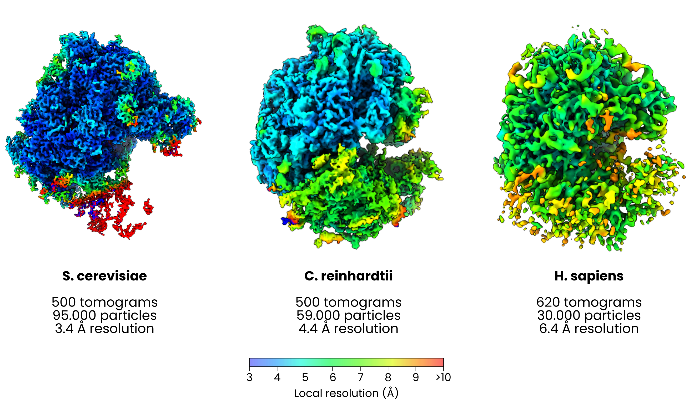
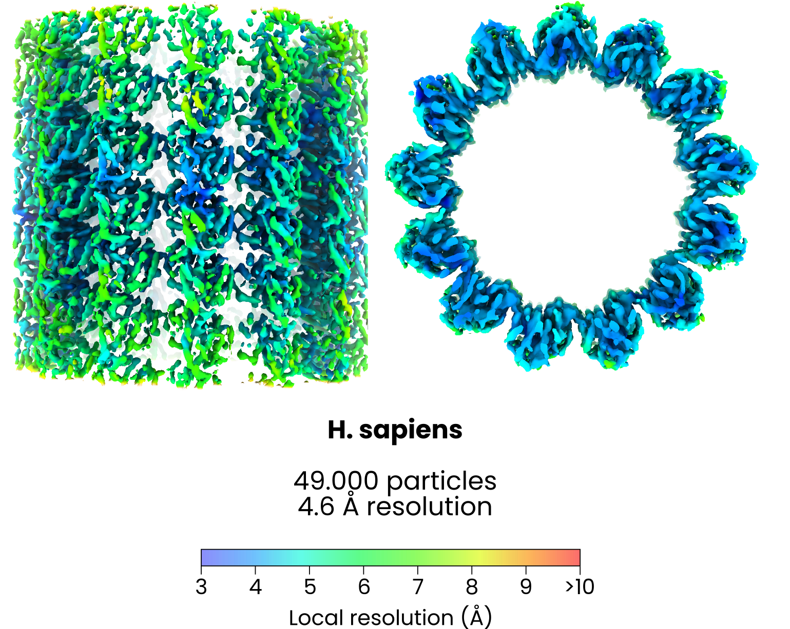

[](https://github.com/mgflast/easymode/LICENSE.txt)
[](https://pypi.org/project/easymode/)
[


## easymode
### a collection of pretrained general networks for cellular cryoET
**Explore the model library [here](https://mgflast.github.io/easymode/models/)**

Easymode is a collection of general pretrained neural networks for cellular cryo-electron tomography (cryoET). The goal is to offer single command line interface functions to handle one of the most time-consuming and tedious steps of the cryoET workflow: feature detection. **Inspired by and based upon [Membrain-seg](https://github.com/teamtomo/membrain-seg), easymode provides general pretrained networks for segmentation of cellular cryoET data.**    

All networks were trained on a dataset of over 2000 tilt series from 50 different sources, covering many prokaryotic, archaeal, and eukaryotic species, different sample preparation techniques (cryo-FIB, lift-out, purified organelles, purified proteins, intact virus particles, whole cells), different hardware configurations (e.g., K2/K3/Falcon4i, 200/300 kV, Volta phase plate), a range of acquisition pixel sizes, electron doses, and defocus values, and lots of different original applications including various subtomogram averaging and benchmarking projects. 

The dataset is biased towards eukaryotic and specifically human cell types. For each tilt series in the collection, we reconstructed tomograms in five 'flavours' using [WarpTools](https://warpem.github.io/), [AreTomo3](https://github.com/czimaginginstitute/AreTomo3), [cryoCARE](https://github.com/juglab/cryoCARE_pip), and [DeepDeWedge](https://github.com/MLI-lab/DeepDeWedge), all at a common voxel size of 10.0 Ångstrom. Training was performed using linear combinations of different tomogram flavours as the input; we use almost exactly the same 3D UNet architecture and many of the same augmentations as used in [Membrain-seg](https://github.com/teamtomo/membrain-seg), including their missing wedge augmentation. Labels were generated by applying [Ais](github.com/bionanopatterning/Ais) 2D UNets to selected subtomograms and manually curating the results.


### validation

We are currently testing the accuracy of the feature detection networks by subtomogram averaging (STA). For a start the goal is to enable decent-resolution STA of the most common particle types, so that these can be used as references for tilt-series alignment and to navigate datasets better. **Please note that these are all preliminary results.** We use three moderately large eukaryotic datasets for the validation: S. cerevisiae (500 tilt series, by the MPI Dortmund team (see table below)), C. reinhardtii (500 tilt series, EMPIAR-11830), and H. sapiens (HeLa) (620 tilt series, our own)

<b>Ribosomes: subtomogram averages from yeast, chlamydomonas, and human cells</b>
```
easymode segment ribosome --data warp_tiltseries/reconstruction --output segmented
easymode pick ribosome --data segmented --output coordinates/ribosome --size 2000000 --spacing 300
> initial averaging in Relion5
> refinement in M
```



<b>Microtubuli: per-filament and global averaging in human cells</b>
```
easymode segment microtubule --data warp_tiltseries/reconstruction --output segmented
easymode pick microtubule --data segmented --output coordinates/ribosome --size 1000000 --spacing 50 --filament --separate_filaments
> initial averaging of individual filaments in Relion5 in order to assign polarity
> refinement in M
```


<b>Vault: subtomogram average from Dictyostelium discoidium (EMPIAR-11899)</b>
```
easymode segment vault --data warp_tiltseries/reconstruction --output segmented
easymode pick vault --data segmented --output coordinates/vault --size 5000000 --spacing 500
> averaging in Relion5, refinement in M, D39 symmetry.
```


### functionality

Pretrained 3D UNets for segmentation of common eukaryotic features are hosted via [🤗 huggingface](https://huggingface.co/mgflast/easymode/tree/main) and are automatically downloaded when you call *easymode*, so you don't need to worry about where to get the network weights from. To see which models are available, use 'easymode list'. Over time we plan for the collection of networks to grow.
```
easymode list
```

```
easymode can currently segment the following features:

   > actin                          (cached) 3d only
   > cytoplasm                      (cached) 3d/2d
   > cytoplasmic_granule            (cached) 3d only
   > membrane                       (cached) 3d only
   > microtubule                    (cached) 3d only
   > mitochondrial_granule          (cached) 3d only
   > mitochondrion                  (update available) 3d/2d
   > npc                            (cached) 3d/2d
   > nuclear_envelope               (cached) 3d/2d
   > nucleus                        (cached) 3d/2d
   > prohibitin                     (cached) 3d only
   > ribosome                       (cached) 3d only
   > tric                           (cached) 3d only
   > vault                          (cached) 3d only
   > void                           (cached) 3d only

```

To segment data, use 'easymode segment'. If the required network weights are not found in your local cache, they are automatically downloaded and stored for use (by default in ~/easymode/*.h5, or change the cache location using 'easymode set --cache_directory').
```
easymode segment <feature> --data <directory containing tomograms>
easymode segment ribosome --data warp_tiltseries/reconstruction
easymode segment tric --data warp_tiltseries/reconstruction --tta 4 --batch 1 --format int8        # 4-fold test-time augmentation, mimimal memory requirement
```
To facilitate data pre-processing you can use the 'reconstruct' command. Using this requires an environment with [WarpTools](https://warpem.github.io/warp/user_guide/warptools/installation/) installed and configuring AreTomo3 paths. In our case we set it up as follows:
```
easymode set --aretomo3_path /public/EM/AreTomo/AreTomo3-2.1.10-cuda12.4/AreTomo3
easymode set --aretomo3_env "module load aretomo3/2.1.10-cu12.4"
```
To turn raw data into reconstructed tomograms, you can then run the following command. Behind the scenes we simply call a sequence of WarpTools commands, move some files, and run AreTomo3 for tilt series alignment. All credit for this utility goes to the authors of [Warp](https://warpem.github.io/warp/team/) and [AreTomo](https://github.com/czimaginginstitute/AreTomo3). 
```
easymode reconstruct --frames <frames_directory> --mdocs <mdocs_directory> --apix <pixel_size> --dose <dose_per_tilt>
easymode reconstruct --frames warp_tiltseries/frames --mdocs warp_tiltseries/mdocs --apix 1.56 --dose 4.6
```
We also distribute pretrained networks for two denoising methods: Noise2Noise (n2n, like cryoCARE) and DeepDeWedge (work in progress!). For each denoising method we offer two processing modes: 'splits', to denoise using even/odd volume splits, or 'direct', to denoise full volumes. This latter method is enabled by transfer learning, where we use the results of even/odd denoising to train networks to denoise straight from full volumes. Although this is not quite statistically sound, the denoising results are decent, the process is twice as fast, and you can save a lot of time and memory by not having to generate even/odd frame and volume splits. 
To use easymode denoising, run:
```
easymode denoise --method {'ddw', 'n2n'} --mode {'splits', 'direct'} --data <directory containing tomograms OR containing subdirectories 'even' and 'odd', depending on selected mode> ...
easymode denoise --method n2n --mode direct --data warp_tiltseries/reconstruction --output denoised
easymode denoise --method ddw --mode splits --data warp_tiltseries/reconstruction --output denoised         # NOTE: ddw weights are not yet available
```
To turn segmentations into coordinates and export starfiles for ingestion in tools such as [Relion](https://github.com/3dem/relion) or [Warp](https://github.com/warpem/warp), use the following commands. Behind the scence we simply call _ais pick <arguments>_ from [Ais](github.com/bionanopatterning/Ais). For filaments, we'll soon release a new version of Ais that can vectorize filaments and sample coordinates along them in a more sophisticated way.
```
easymode pick <feature> --data <directory containing segmentations corresponding to the feature> --output <output_directory> --size <minimum particle volume in cubic Å> --spacing <minimum inter-particle distance in Å>
easymode pick ribosome --data segmented/ --output coordinates/ribosome --size 2000000 --spacing 300
```
Finally, to clear up valuable disk space (run with care!)
```
easymode clean --frame_halfmaps --volume_halfmaps --frame_averages --thumbnails --aretomo --tiltstacks         # use these flags to specify what to delete
easymode clean <> --confirm                                                                                    # to actually delete files
easymode clean <> --list                                                                                       # to list the files that would be deleted
```

### data sources

Not all training data sources are currently listed, because a number of contributors prefer to remain anonymous so long as their work is not published. These contributions are marked with *.


| ID          | Contributor / source                                                 | Sample type                                | N (annotated) | Pixel size (Å) |
|-------------|----------------------------------------------------------------------|--------------------------------------------|---------------|----------------|
| 001_HELA    | Mart Last                                                            | milled H. sapiens (HeLa)                   | 60 (59)       | 1.51           |
| 002_U2OS    | Mart Last                                                            | milled H. sapiens (U2OS)                   | 40 (26)       | 2.15           |
| 003_HSPERM  | Tom Dendooven, Alia dos Santos, Matteo Allegretti                    | milled H. sapiens (spermatozoa)            | 56 (41)       | 1.50           |
| 004_*       | *                                                                    | *                                          | 23 (20)       | 1.68           |
| 005_FIBRO   | Tom Hale                                                             | milled H. sapiens (fibroblasts)            | 52 (47)       | 1.33           |
| 006_*       | *                                                                    | *                                          | 20 (16)       | 1.69           |
| 007_APOF    | EMPIAR-10491                                                         | purified apoferritin                       | 37 (18)       | 0.79           |
| 008_HIV     | EMPIAR-10164                                                         | purified HIV particles                     | 10 (4)        | 0.68           |
| 009_SCEREV  | Sebastian Tacke, Elisa Lisicki, <br/>Tatjana Taubitz, Stefan Raunser | milled (hpf, pfib) S. cerevisiae           | 64 (51)       | 1.56           |
| 010_RIBO    | EMPIAR-11111                                                         | purified E. coli 70S ribosomes             | 25 (19)       | 1.07           |
| 011_CHLO    | EMPIAR-12612                                                         | milled S. oleracea chloroplasts            | 23 (18)       | 3.52           |
| 012_CHLAMY  | EMPIAR-11830                                                         | milled C. reinhardtii                      | 52 (50)       | 1.96           |
| 013_DIAT    | EMPIAR-11747                                                         | milled T. pseudonana                       | 7  (1)        | 1.07           |
| 014_CILIA   | EMPIAR-11078                                                         | milled C. reinhardtii ciliary base         | 23 (19)       | 3.42           |
| 015_MMVOLTA | CDPDS-10452                                                          | whole M. mycoides cells                    | 15 (15)       | 1.53           |
| 016_PHANTOM | CDPDS-10440, CDPDS-10445                                             | E. coli lysate with added proteins         | 19 (17)       | 1.53           |
| 017_MYCP    | EMPIAR-10499                                                         | whole M. pneunomiae cells                  | 65 (27)       | 1.70           |
| 018_ECM     | EMPIAR-11897                                                         | lift-out H. sapiens (extracellular matrix) | 39 (24)       | 2.14           |
| 019_ECOLI   | EMPIAR-12413                                                         | milled E. coli                             | 44 (19)       | 1.90           |
| 020_*       | *                                                                    | *                                          | 30 (25)       | 2.13           |
| 021_*       | *                                                                    | *                                          | 8  (7)        | 3.02           |
| 022_SCOV    | EMPIAR-10493                                                         | purified SARS-CoV-2 virions                | 20 (12)       | 1.53           |
| 023_SPORE   | EMPIAR-12176                                                         | milled E. intestinalis                     | 24 (11)       | 2.06           |
| 024_*       | *                                                                    | *                                          | 17 (6)        | 1.96           |
| 025_RPE     | EMPIAR-10989                                                         | cellular periphery H. sapiens (RPE1)       | 3  (3)        | 3.45           |
| 026_EHV     | EMPIAR-11896                                                         | Emiliania huxleyi virus 201                | 40 (10)       | 2.08           |
| 027_NUCFT   | Forson Gao                                                           | milled S. cerevisiae nuclei                | 21 (15)       | 1.51           |
| 028_ROOF    | CDPDS-10434                                                          | cellular periphery H. sapiens (HEK293)     | 20 (19)       | 2.17           |
| 029_TKIV    | EMPIAR-11058                                                         | milled T. kivui                            | 17 (7)        | 3.52           |
| 030_LDN     | Mart Last                                                            | cellular periphery H. sapiens (U2OS)       | 26 (7)        | 2.74           |
| 031_MITO    | Mart Last                                                            | milled H. sapiens (HeLa, mitochondria)     | 63 (59)       | 1.34           |
| 032_*       | *                                                                    | *                                          | 40 (24)       | 1.63           |
| 033_NPC     | EMPIAR-11830 (same source as 012_CHLAMY)                             | milled C. reinhardtii (nuclear envelope)   | 36 (36)       | 1.96           |
| 034_DICTYO  | EMPIAR-11845                                                         | milled D. discoideum                       | 152 (68)      | 2.18           |
| 035_GEM     | EMPIAR-11561                                                         | milled H. sapiens (HeLa, mitochondria)     | 15 (14)       | 3.43           |
| 036_MACRO   | EMPIAR-12457                                                         | milled H. sapiens (macrophages)            | 39 (21)       | 2.41           |
| 037_MESWT   | EMPIAR-12460                                                         | milled M. musculus (embryonic stem cell)   | 159 (26)      | 2.68           |
| 038_POMBE   | EMPIAR-10988                                                         | milled S. pombe                            | 9 (6)         | 3.37           |
| 039_JUMBO   | EMPIAR-11198                                                         | milled E. amylovora + RAY phage            | 32 (4)        | 4.27           |
| 040_SLO     | CDPDS-10004                                                          | milled (hpf, pfib) C. elegans              | 100 (24)      | 1.50           |
| 041_RPEM    | Cong Yu                                                              | milled H. sapiens (RPE1)                   | 17 (7)        | 1.57           |
| 042_NPCSC   | EMPIAR-10466                                                         | milled S. cerevisiae                       | 177 (0)       | 3.45           | 
| 043_DICTY2  | EMPIAR-11899 (to be included after validation)                       | milled D. discoideum                       | 0 (0)         | 1.22           |
| 044_JURKAT  | Mart Last                                                            | milled H. sapiens (Jurkat)                 | 177 (0)       | 1.97           |
| 045_NPHL    | *                                                                    | *                                          | 231 (0)       | 1.56           |
| 046_ROOF2   | CDPDS-10431                                                          | cellular preiphery H. sapiens (HEK293)     | 87 (0)        | 2.17           |
| 047_ECPP7   | DS-10455                                                             | E. coli + PP7 virus-like particles         | 30 (0)        |                |
| 048_ELSO    | DS-10444                                                             | human endo-/lysosomes                      | 30 (0)        |                |
| 049_CHR     | *                                                                    | *                                          | 30            |                |

EMPIAR: [EM Public Image Archive](https://www.ebi.ac.uk/empiar/) dataset
CDPDS: [CryoET Data Portal](https://cryoetdataportal.czscience.com/) dataset

### references

This work relies upon & was inspired by:

1 - Tegunov et al., 'Multi-particle cryo-EM refinement with M visualizes ribosome-antibiotic complex at 3.5 Å in cells', Nature Methods (2021): https://doi.org/10.1038/s41592-020-01054-7 https://github.com/warpem/warp

2 - Tegunov & Cramer, 'Real-time cryo-electron microscopy data preprocessing with Warp', Nature Methods (2019): https://doi.org/10.1038/s41592-019-0580-y https://github.com/warpem/warp

3 - Peck et al., 'AreTomoLive: Automated reconstruction of comprehensively-corrected and denoised cryo-electron tomograms in real-time and at high throughput', bioRxiv (2025): https://doi.org/10.1101/2025.03.11.642690 38https://github.com/czimaginginstitute/AreTomo3 

4 - Lamm et al., 'MemBrain v2: an end-to-end tool for the analysis of membranes in cryo-electron tomography', bioRxiv (2024): https://doi.org/10.1101/2024.01.05.574336 https://github.com/CellArchLab/MemBrain-v2

5 - Burt et al., 'An image processing pipeline for electron cryo-tomography in RELION-5', FEBS Open Bio (2024): https://doi.org/10.1002/2211-5463.13873 https://github.com/3dem/relion

6 - Buchholz et al., 'Content-aware image restoration for electron microscopy', IEEE (2019): https://dor.org/10.1109/ISBI.2019.8759519 https://github.com/juglab/cryoCARE_pip

7 - Wiedemann & Heckel, 'A deep learning method for simultaneous denoising and missing wedge reconstruction in cryogenic electron tomography', Nature Communications (2024): https://doi.org/10.1038/s41467-024-51438-y https://github.com/MLI-lab/DeepDeWedge  

8 - Last et al., 'Streamlining segmentation of cryo-electron tomography datasets with Ais', eLife (2024): https://doi.org/10.7554/eLife.98552.3 https://www.github.com/bionanopatterning/Ais