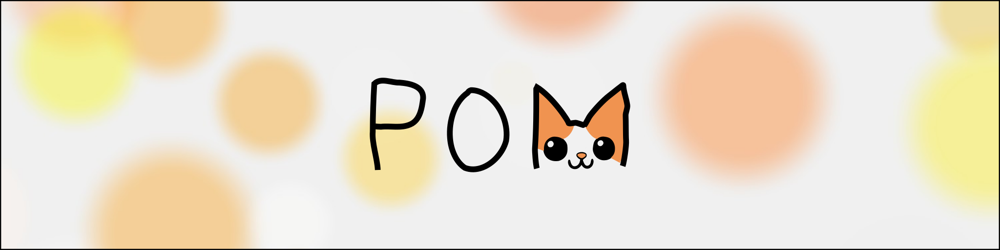

<h2 style="text-align: center; font-weight: bold;">Pretrained general networks for cellular cryoET</h2>
<h3 style="text-align: center; font-weight: bold; font-style: italic;">artisanally crafted in Cambridgeshire, UK</h3>

Trained on a large and curated body of cryoET datasets, **easymode** provides pretrained networks for feature detection in cellular cryoET. Our models are hosted via [Hugging Face](https://huggingface.co/mgflast/easymode/tree/main) and automatically distributed for inference – meaning you don't need to worry about downloading model weights.

Simply call `easymode segment ribosome`, point to your data, and easymode will do the rest. Or `microtubule`. Or `mitochondrion`. Or `npc`. Or `tric`. Or check out the [full model library](models/index.md).

## Where easymode fits

easymode was designed for use with [WarpTools](https://warpem.github.io), [Relion](https://github.com/3dem/relion), and [M](https://warpem.github.io/), and for general segmentation of any flavour of cryoET tomogram — raw, denoised, or missing-wedge corrected. It was built on [Ais](https://mgflast.github.io/Ais/) and works great with [Pom](https://github.com/mgflast/Pom).

## Training data collection

All easymode models were trained using the **easymode training data collection**, consisting of over 4,700 tilt series and covering 30 different species, 70 unique dataset contributions, and a wide range of microscopes, sample types, and acquisition parameters — including a lot of variety in sample thickness, pixel size, defocus, doses, tilt ranges, tilt increments, and detectors.

We thank Tom Dendooven, Tom Hale, Alia dos Santos, Piotr Kolata, Alexander Scrutton, Forson Gao, Cong Yu, Paula Paredes Vergara, Kashish Singh, Eric Wang, Andriko von Kügelgen, Maite Freire Delgado, Mike Sleutel, David Barford, Katrina Gundlach, Oda Schiøtz, Ariane Briegel, Jürgen Plitzko, Sebastian Tacke, Elisa Lisicki, Tatjana Taubitz, and Stefan Raunser for their contributions, and gratefully acknowledge the following EMPIAR datasets: [10164](https://www.ebi.ac.uk/empiar/EMPIAR-10164/), [10466](https://www.ebi.ac.uk/empiar/EMPIAR-10466/), [10491](https://www.ebi.ac.uk/empiar/EMPIAR-10491/), [10493](https://www.ebi.ac.uk/empiar/EMPIAR-10493/), [10499](https://www.ebi.ac.uk/empiar/EMPIAR-10499/), [10988](https://www.ebi.ac.uk/empiar/EMPIAR-10988/), [10989](https://www.ebi.ac.uk/empiar/EMPIAR-10989/), [11058](https://www.ebi.ac.uk/empiar/EMPIAR-11058/), [11078](https://www.ebi.ac.uk/empiar/EMPIAR-11078/), [11111](https://www.ebi.ac.uk/empiar/EMPIAR-11111/), [11198](https://www.ebi.ac.uk/empiar/EMPIAR-11198/), [11538](https://www.ebi.ac.uk/empiar/EMPIAR-11538/), [11561](https://www.ebi.ac.uk/empiar/EMPIAR-11561/), [11747](https://www.ebi.ac.uk/empiar/EMPIAR-11747/), [11830](https://www.ebi.ac.uk/empiar/EMPIAR-11830/), [11845](https://www.ebi.ac.uk/empiar/EMPIAR-11845/), [11896](https://www.ebi.ac.uk/empiar/EMPIAR-11896/), [11897](https://www.ebi.ac.uk/empiar/EMPIAR-11897/), [11899](https://www.ebi.ac.uk/empiar/EMPIAR-11899/), [12176](https://www.ebi.ac.uk/empiar/EMPIAR-12176/), [12425](https://www.ebi.ac.uk/empiar/EMPIAR-12425/), [12457](https://www.ebi.ac.uk/empiar/EMPIAR-12457/), [12460](https://www.ebi.ac.uk/empiar/EMPIAR-12460/), [12612](https://www.ebi.ac.uk/empiar/EMPIAR-12612/), [13145](https://www.ebi.ac.uk/empiar/EMPIAR-13145/), [13281](https://www.ebi.ac.uk/empiar/EMPIAR-13281/), [13289](https://www.ebi.ac.uk/empiar/EMPIAR-13289/); and CryoET Data Portal datasets: [10004](https://cryoetdataportal.czscience.com/datasets/10004), [10431](https://cryoetdataportal.czscience.com/datasets/10431), [10434](https://cryoetdataportal.czscience.com/datasets/10434), [10440](https://cryoetdataportal.czscience.com/datasets/10440), [10444](https://cryoetdataportal.czscience.com/datasets/10444), [10452](https://cryoetdataportal.czscience.com/datasets/10452), [10455](https://cryoetdataportal.czscience.com/datasets/10455).

Check out our other tools:

  
  

