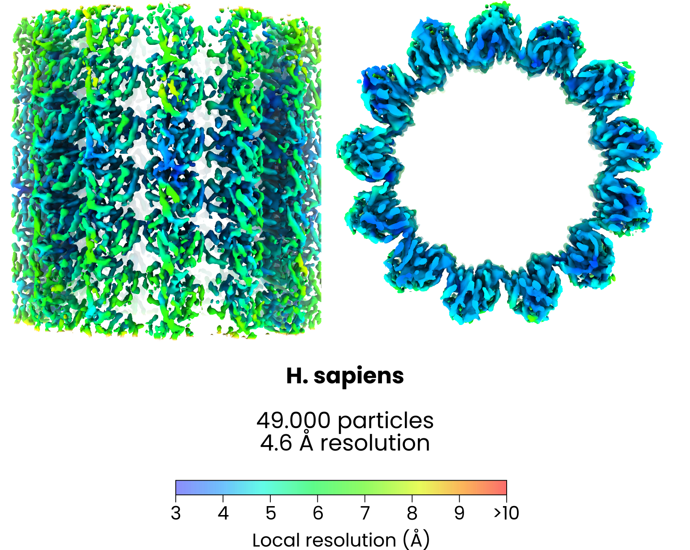

`easymode segment microtubule`

The microtubule model was trained to output a cylindrical tube with a diameter of 180 Å along microtubules, approximately **annotating the lumen of microtubules only**. As a result, closely adjacent microtubules are still segmented as individual filaments.

In combination with the `--filament` flag in `easymode pick`, the model enables tracing individual microtubules and picking particles at regular intervals along individual filaments, with an **accurate prior on the particle orientation** and class labels linking particles to the parent filaments (_aisFilamentID). Use the `--per-filament` flag to write .star files for individual microtubules. This allows subtomogram averaging of individual filaments. 

For validation, we segmented, picked, and averaged microtubules in a large dataset of FIB-milled HeLa cell tomograms. After using per-filament averaging to determine polarity and protofilament count, then subboxing individual protofilaments, we achieved a 4.6 Å overall resolution (49k particles). 

!!! note
    At 4.6 Å resolution, differences between alpha and beta tubulin are still almost impossible to see. We didn't bother trying to sort out the seam during the averaging process.

**Example output**
 

  <video autoplay loop muted playsinline controls style="width:100%; max-width:720px; aspect-ratio:16/9; background:#fff; border-radius:8px; display:block; margin:auto;">
    <source src="../../assets/microtubule.mp4" type="video/mp4">
    Video failed to load.
  </video>

Example of `easymode segment microtuble` output overlaid on a tomogram from EMPIAR-11899 (FIB-milled D. discoideum).

