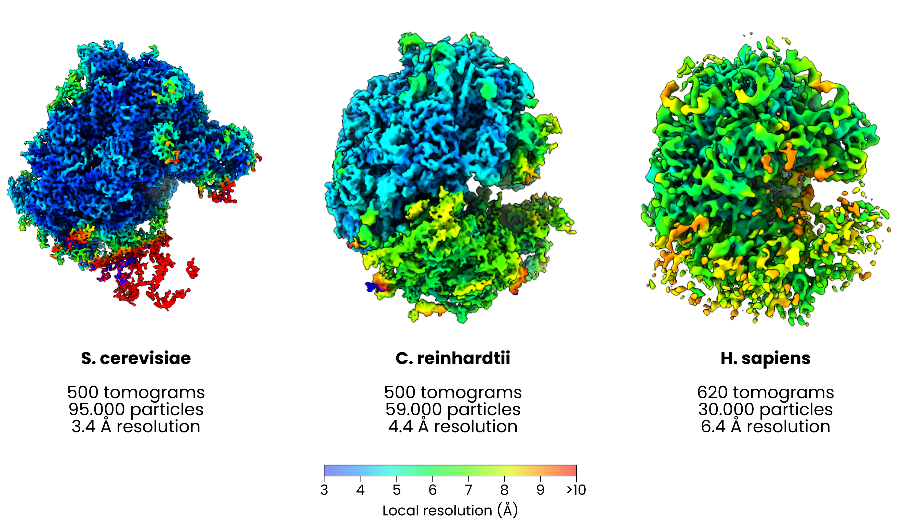

`easymode segment ribosome`

The ribosome model is a shape-based ribosome segmentation model and was trained on manually selected 3D subtomograms that were labelled using a 2D Ais UNet + post-processing. It was trained at the default easymode pixel size of 10 Å/px on training data samples from bacteria as well as eukaryotes. And one archaeon.

Validation so far shows that the model supports picking and subtomogram averaging to high resolution in S. cerevisiae (3.4 Å, 95k particles), C. reinhardtii (4.4 Å, 59k particles) and H. sapiens (6.4 Å, 30k particles). 

  

**Example output**
 

  <video autoplay loop muted playsinline controls style="width:100%; max-width:720px; aspect-ratio:16/9; background:#fff; border-radius:8px; display:block; margin:auto;">
    <source src="../../assets/ribosome.mp4" type="video/mp4">
    Video failed to load.
  </video>

Example of `easymode segment ribosome` output overlaid on a tomogram from EMPIAR-11899 (FIB-milled D. discoideum). 