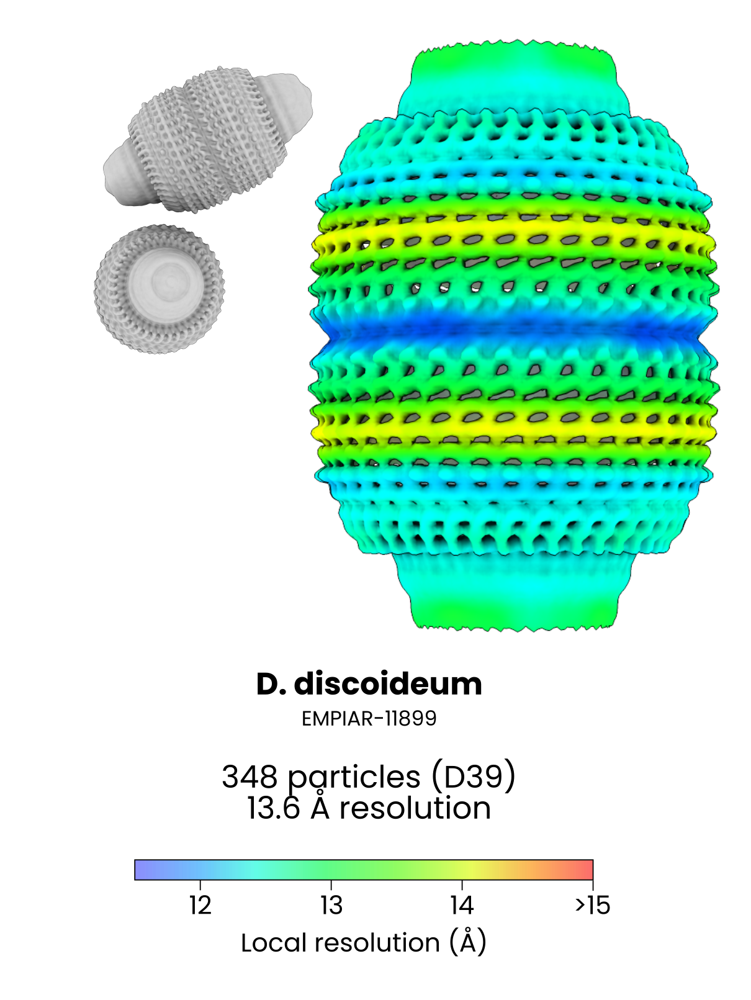

`easymode segment vault`

The vault model was trained on manually curated 3D subtomograms that were labelled by a 2D Ais UNet. The Ais net output a shape-based segmentation of vaults; as a result, the 3D easymode network also outputs vault shape, although with strong missing wedge artefacts. This does not really matter for picking.

For initial validation we used dataset [EMPIAR-11845](https://www.ebi.ac.uk/empiar/EMPIAR-11845), consisting of 152 tomograms of FIB-milled D. discoideum cells. For the sake of the validation we re-trained the vault networks with data from this source excluded from the training collection.  

Vaults remain rare even in this dataset; we found on average between 2 to 3 particles per tomogram, or 348 in total. With D39 symmetry, subtomogram averaging plateaued at a resolution of 13.6 Å. The very cap of the vault, where the D39 symmetry breaks (see [Lövestam and Scheres, Structure, 2025](https://www.cell.com/structure/fulltext/S0969-2126(25)00262-X)), was excluded from the mask.

**Example output**
 

  <video autoplay loop muted playsinline controls style="width:100%; max-width:720px; aspect-ratio:16/9; background:#fff; border-radius:8px; display:block; margin:auto;">
    <source src="../../assets/vault.mp4" type="video/mp4">
    Video failed to load.
  </video>

Example of `easymode segment vault` output overlaid on a tomogram from EMPIAR-11899 (FIB-milled D. discoideum).

