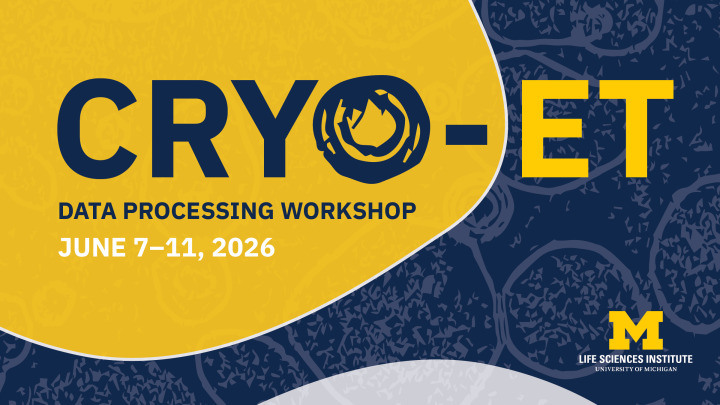
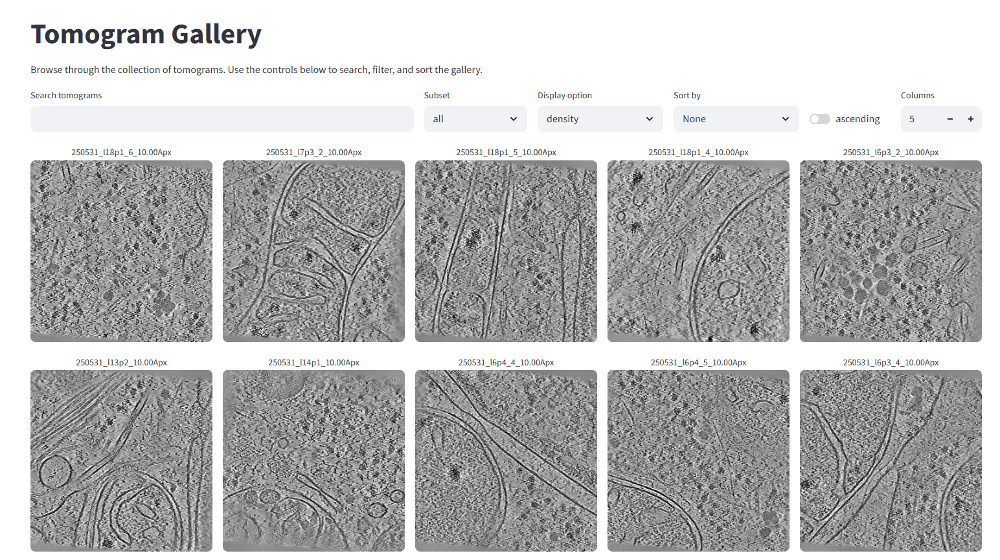
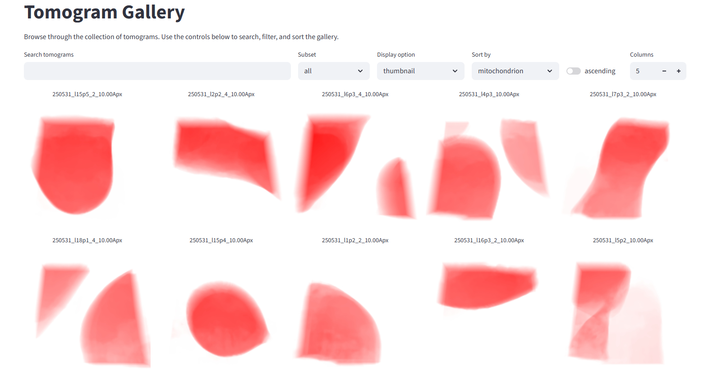
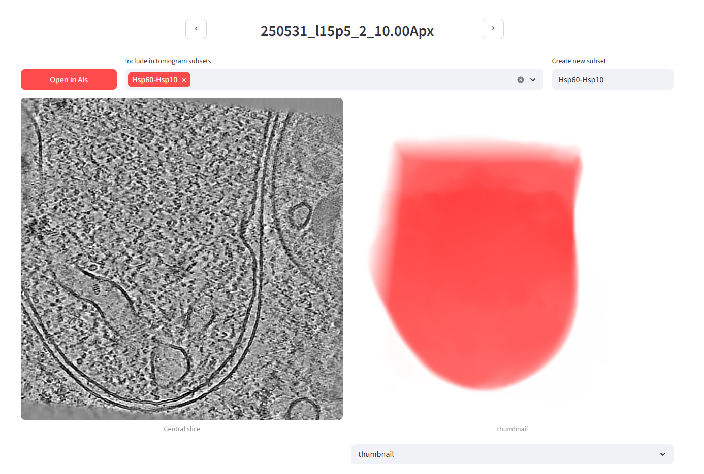
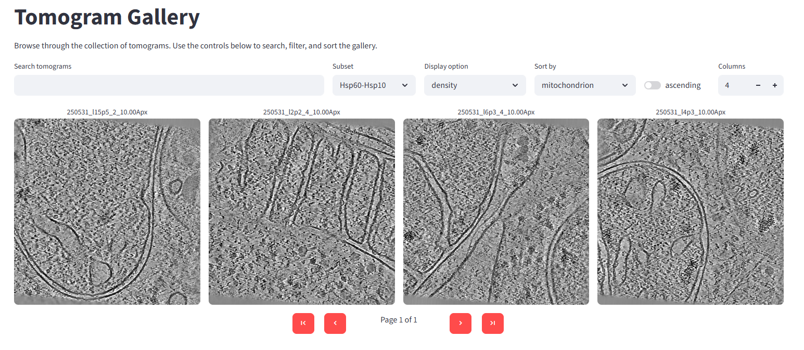
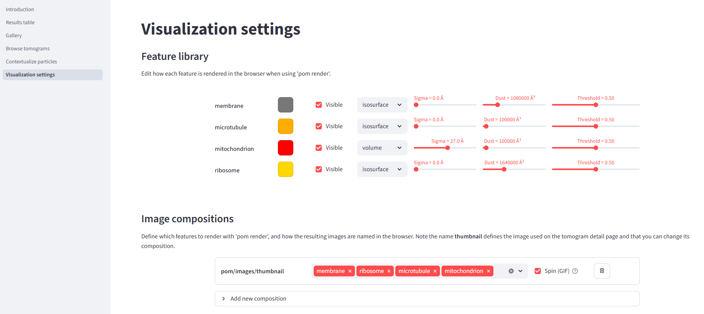

<style>
[data-md-color-primary] {
  --md-primary-fg-color: #FFCB05 !important;
  --md-primary-fg-color--light: #FFCB05 !important;
  --md-primary-fg-color--dark: #FFCB05 !important;
  --md-primary-bg-color: #10284c !important;            /* UMich blue header text */
  --md-primary-bg-color--light: rgba(16, 40, 76, 0.7) !important;
}
[data-md-color-accent] {
  --md-accent-fg-color: #10284c !important;             /* UMich blue */
  --md-accent-fg-color--transparent: rgba(16, 40, 76, 0.1) !important;
  --md-accent-bg-color: #ffffff !important;
  --md-accent-bg-color--light: rgba(255, 255, 255, 0.7) !important;
}

.md-header__topic:first-child .md-ellipsis {
  font-size: 0;
}
.md-header__topic:first-child .md-ellipsis::before {
  content: "2026 Cryo-Electron Tomography Data Processing Workshop";
  font-size: 1.125rem;
  font-weight: 600;
}
</style>

<p style="text-align: center;">
  
</p>

## CryoET data processing with Warp, easymode, and Pom
*University of Michigan - July 8th, 2026*

The goal of this tutorial is to run through the whole front-end of cryoET data processing in one day. In the morning we will cover every step in the tomogram reconstruction pipeline in Warp: starting with raw frames, ending with denoised tomograms. In the afternoon, we will explore and visualize the biological content of the tomograms and briefly look at some downstream processes that you might want to apply in your own work: particle picking & subtomogram averaging, training a custom network for segmentation, or performing measurements on particles in their context.

!!! info "Credit"
    The Warp portion of this tutorial is heavily based on Dimitry Tegunov and Alister Burt's [WarpTools tilt-series quick start](https://warpem.github.io/warp/user_guide/warptools/quick_start_warptools_tilt_series), adapted to the workshop dataset.

### 🌅 Morning - from raw data to tomograms with WarpTools

#### 0. Data layout

The dataset consists of just raw frame stacks and mdocs for 50 tilt series collected on plasma-FIB milled, mycophenolic acid-treated HeLa cells. Copy the `frames/` and `mdocs/` directories over to your drive. Don't copy the other folders yet (`pom` and `ribosomes`) - those are for later.

```
project_root/
├── frames/        # 1550 .tiff stacks, one per tilt
│   ├── 250531_l1p2_001_10.00_20250531_*_Fractions.tiff
│   ├── 250531_l1p2_002_13.00_20250531_*_Fractions.tiff
│   └── ...
└── mdocs/         # 50 .mdoc files, one per tilt series
    ├── 250531_l1p2.mdoc
    ├── 250531_l1p2_2.mdoc
    └── ...
```

#### 1. Frame series processing settings

```
WarpTools create_settings \
    --output warp_frameseries.settings \
    --extension "*.tiff" \
    --angpix 1.514 \
    --exposure 4.60 \
    --folder_data frames/ \
    --folder_processing warp_frameseries
```

#### 2. Motion correction and CTF estimation

```
WarpTools fs_motion_and_ctf \
    --settings warp_frameseries.settings \
    --m_grid 1x1x5 \
    --c_grid 2x2x1 \
    --c_range_max 4.0 \
    --c_defocus_max 7 \
    --out_averages
    --perdevice 4
```

After running this command, the warp_frameseries/ directory will contain one .xml file for every tilt image (frame) in the dataset. A subdirectory warp_frameseries/average contains the motion-corrected frames as .mrc files. Once files live in Warp processing output folders, you generally don't need to think too much about what's in them and where they live - until perhaps you run in to issues later on. Most of the important metadata is contained in warp_tiltseries/*.xml files, and these are versioned. A brute-force reset of the metadata can sometimes be useful (for example if a tilt selection job or a refinement in M has gone awry): copy the files from the olders warp_tiltseries/versions/ directory back over into warp_tiltseries. 

??? note "Note on the processing parameters"
    The values used here depend on your acquisition. The 3rd value of `--m_grid` would typically be the number of fractions per tilt image - 5 in our case (which is a bit on the low side). Data from a Falcon4 detector doesn't really have a fixed number of fractions in the same way, so instead you would set `--eer_ngroups` in `WarpTools create_settings` (or leave it out and rely on the auto settings, which are generally fine). `--c_defocus_max` is the maximum CTF defocus value allowed during fitting; the tutorial dataset was acquired with a defocus range of 2.5-5 µm, so 7 is conservative. `--c_range_max` caps the frequency (expressed as a resolution in Å) up to which CTF fitting is performed - it must be larger than 2 × pixel_size (Nyquist).

??? note "`--out_averages` and `--out_average_halves`"
    Unsupervised denoising methods like noise2noise, DeepDeWedge, IsoNet2, etc., are trained on independent half splits (even/odd). Half splits can be generated two ways: by splitting frames at motion correction time (**frame-based**) or by splitting tilts at reconstruction time (**tilt-based**). As described in the [cryoCARE paper](https://ieeexplore.ieee.org/stamp/stamp.jsp?arnumber=8759519), frame-based splitting yields better results. If you wanted to train a network with any of these methods, you would therefore have to add `--out_average_halves` here, to output the frame splits you later need to generate tomogram half splits. We skip this in the tutorial because for denoising we will use a pretrained general noise2noise-style network. 

#### 3. Importing tilt series

Motion correction and CTF estimation are essentially the only preprocessing steps applied to the frames. The next step is to import tilt series. WarpTools parses the `.mdoc` files in `mdocs/` to determine which frames belong to which tilt series, and in what order. If you ever want to rename a tilt series / tomogram, you can do so simply by renaming the mdoc prior to running `WarpTools ts_import` - the content of the mdoc does not need to be changed.

```
WarpTools ts_import \
    --mdocs mdocs/ \
    --frameseries warp_frameseries \
    --tilt_exposure 4.60 \
    --min_intensity 0.3 \
    --dont_invert \
    --output tomostar
```

??? note "Tilt axis angle"
    For `.mdoc` files written by Tomo5, WarpTools will warn that the tilt axis angle may be incorrect. You can ignore this - AreTomo3 will work regardless. In general the tilt axis angle will be known exactly by your EM managers, so if you do run in to issues you can simply add `--override_axis 86.4` (or whatever the angle is).

#### 4. Tilt series processing settings

```
WarpTools create_settings \
    --output warp_tiltseries.settings \
    --folder_processing warp_tiltseries \
    --folder_data tomostar \
    --extension "*.tomostar" \
    --angpix 1.514 \
    --exposure 4.60 \
    --tomo_dimensions 4096x4096x1981
```

??? note "Tilt series and tomogram pixel size"
    `--angpix` is the **acquisition** pixel size, 1.514 Å/px in this case. The pixel size at which tomograms are actually reconstructed is arbitrary; 10.0 Å/px is convenient because that is what tools like MemBrain, TomoTwin, and easymode were trained on. However, large pixel sizes may limit the accuracy of template-matching-based picking approaches. See Joe Dobbs and Julia Mahamid's recent [preprint](https://www.biorxiv.org/content/10.64898/2026.04.12.717927v1.abstract), for a discussion. `--tomo_dimensions` sets the output volume shape in pixels at the **acquisition** pixel size (here, 1.514 Å/px) - not at the reconstruction pixel size. Use the detector dimensions for X and Y (a Falcon4i, in the tutorial data). To make the output tomograms span 300 nm in Z, set Z to `3000 Å / apix` ≈ 1981.

#### 5. Exporting tilt stacks
Saving all tilt images in a single stack is somewhat redundant - Warp or M don't refer to these tilt stacks themselves but instead always get data directly from the frame averages. But for tilt series alignment with AreTomo3 we do need the stacks. In principle the stacks can be deleted again after running the alignment, to free up memory.

```
WarpTools ts_stack \
    --settings warp_tiltseries.settings \
    --perdevice 2
```

#### 6. Tilt series alignment

Tilt series alignment is one of the core cryoET data processing steps for which WarpTools does not (yet) offer its own implementation (but see Marten Chaillet et al.'s [MissAlignment](https://www.biorxiv.org/content/10.64898/2026.04.29.721716v1)). Instead, WarpTools wraps [etomo](https://bio3d.colorado.edu/imod/doc/etomoTutorial.html) or [AreTomo2](https://github.com/czimaginginstitute/AreTomo2). In this tutorial we will use a custom wrapper that uses AreTomo3.

Regardless of which tool you use, the tilt-series alignment results are slotted directly back into the Warp pipeline by copying the alignment parameters (`.xf`, `.tlt`, `.xtilt`, etc.) into `warp_tiltseries/alignments/*/`, from where Warp will parse them and store the values in the corresponding tilt-series `.xml` files.

The wrapper for the workshop, `ts_aretomo3.py`, is a single Python script that (1) runs AreTomo3 in parallel across the available GPUs on every tilt stack under `warp_tiltseries/tiltstack/*/`, and (2) copies the resulting `*_Imod/` folders into `warp_tiltseries/alignments/`. Grab it with:

```
wget https://mgflast.github.io/easymode/assets/ts_aretomo3.py
```

or copy it from `path/to/tutorial_data/various/ts_aretomo3.py` and run it from the project root:

```
python ts_aretomo3.py --aretomo3 /path/to/AreTomo3 --gpus 0,1,2,3
```

Once the script has finished, have WarpTools import the alignments with:

```
WarpTools ts_import_alignments \
    --settings warp_tiltseries.settings \
    --alignments warp_tiltseries/alignments \
    --alignment_angpix 1.514
```

#### 7. Tilt series CTF estimation
```
WarpTools ts_ctf \
    --settings warp_tiltseries.settings \
    --defocus_max 7 \
    --perdevice 4
```

#### 8. Reconstructing the tomograms
Now that we have good estimates of the tilt series CTF and aligned the tilt series we can finally reconstruct the tomograms. We do this at 10 Å/px - a good tradeoff between the level of detail we can see at that pixel size (more than enough for visualisation, segmentation, and picking) and memory consumption. The tomograms that Warp outputs (and which we look at, and may use for manual segmentation or picking) are really only ever used for visualisation: whenever you use Warp to prepare data for subtomogram averaging in RELION, or use Warp/M for STA refinement, the software always refers back to the frames, not to the reconstructed tomograms. The pixel size at which you export tomograms therefore has no bearing on the achievable downstream resolution - other than indirectly, through how it affects the accuracy of particle picking.

```
WarpTools ts_reconstruct \
    --settings warp_tiltseries.settings \
    --angpix 10.0 \
    --dont_invert \
    --perdevice 2
```

??? note "`--halfmap_frames` and `--halfmap_tilts`"
    Same story as the half-splits discussion in step 2: if you wanted to train a noise2noise / DeepDeWedge / IsoNet2-style network on this dataset, you would reconstruct two tomograms per tilt series - one for each half - by adding `--halfmap_frames` (preferred, but requires `--out_average_halves` to have been set back in step 2) or `--halfmap_tilts` (works with what we have, but gives lower-quality splits per the [cryoCARE paper](https://ieeexplore.ieee.org/stamp/stamp.jsp?arnumber=8759519)). We skip both because we will use a pretrained general denoiser later.

??? note "`--dont_invert`"
    `--dont_invert` keeps the tomograms in their as-acquired contrast: protein density is dark on a light background, the same way it appears in the raw frames. Subtomogram averages and density maps are conventionally displayed inverted (protein light on a dark background), but we leave that flip to the downstream STA tools (RELION, M) - they expect inverted maps and handle the inversion themselves. Keeping tomograms uninverted at this stage avoids any ambiguity about which sign convention is in play.

#### 9. Denoising

We now have 50 raw tomograms in `warp_tiltseries/reconstruction/`. Their contrast is quite limited - the signal-to-noise ratio in cryoEM and cryoET is always very poor. Fortunately there are various ways to denoise the data; perhaps the most commonly used cryoET denoiser of the last few years has been [cryoCARE](https://ieeexplore.ieee.org/stamp/stamp.jsp?arnumber=8759519), which is based on the [noise2noise framework](https://arxiv.org/abs/1803.04189).

??? note "Noise2Noise framework"
    Take two independent noise-corrupted observations of the same underlying signal, and train a network to predict one from the other. The signal is identical in both; the noise is not. The best the network can do, then, is to predict the signal without the noise - and it learns this without ever being shown a clean target. Because cryoET data is recorded as dose-fractionated movies, it lends itself directly to the required splitting and is therefore very well suited to Noise2Noise-style denoising. 

This is where the halfmap discussion from steps 2 and 8 comes back. The classic noise2noise recipe trains a denoiser on the independent even/odd half-splits of your own dataset, then applies it to each half at inference time. Generating and storing those half-splits roughly triples the size of `warp_frameseries/` and `warp_tiltseries/`, and training the network on them takes hours. We sidestep both costs by using one of easymode's pretrained [general denoisers](../functions/general_denoisers.md) instead: a single n2n network distilled from >20,000 half-split subtomograms sampled across 48 different datasets, whose output approximates that of a model trained specifically on your data - qualitatively, at least; we haven't rigorously benchmarked the two options.

```
conda activate easymode
easymode denoise --data warp_tiltseries/reconstruction --method n2n --output denoised
```

??? note "When to train your own denoiser"
    Both n2n and wedge-inpainting models learn to adapt to the specifics of your acquisition. In n2n's case, to the particular noise statistics; for wedge inpainting, additionally to the missing-wedge geometry and the structural priors of your sample. A single general network can only approximate this, so for theoretically optimal denoising performance you would want to train a new network on your own data. Because these denoising methods are unsupervised the only cost of doing this is compute.

    That said, for use within the easymode toolchain - data inspection, segmentation, picking - the pretrained general denoisers are perfectly adequate. They were in fact used during training of the segmentation networks, so applying them at inference time tends to *improve* segmentation results rather than hurt them.

    We're also working on general [DeepDeWedge](https://github.com/MLI-lab/DeepDeWedge)- and [IsoNet2](https://github.com/IsoNet-cryoET/IsoNet2)-derived networks. The DeepDeWedge one is already available - run `easymode denoise` with `--method ddw`. It is still a bit preliminary, though: we accidentally trained it for far too long and the result ended up a bit weird, so use with care.

#### 10. Couldn't this be automated?

You'll have noticed that with WarpTools, processing cryoET data from raw frames to reconstructed tomograms is just a matter of stringing together some commands - starting with motion correction and CTF estimation, parsing tilt series metadata, assembling the tilt stack, aligning the tilt series, then improved CTF fitting and finally reconstruction. You will probably always be doing these steps in this order, and there isn't a lot of input to give or curation to do along the way. So with a simple script that calls all the WarpTools in order you could just automate the whole procedure. This is available in easymode, but you can also point your favourite LLM at the [WarpTools documentation](https://warpem.github.io/warp/reference/warptools/api/general/) and [easymode wrapper](https://github.com/mgflast/easymode/blob/master/src/easymode/core/warp_wrapper.py) and tell it the specifics of your compute environment, and with some iteration it'll probably cook something up that works.

```
easymode set --aretomo3-path "path/to/AreTomo3"
easymode set --aretomo3-env "module load AreTomo3"                  
easymode reconstruct --frames frames/ --mdocs mdocs/ --apix 1.514 --dose 4.6 --no_halfmaps
```

But in general I would recommend running through the pipeline manually a couple of times before relying on automation. Then at least when something breaks or crashes, you'll have an idea about what's going on and possibly how to fix it.

### 🌇 Afternoon - from tomograms to cellular landscapes with easymode/Pom

CryoET data is generally very complex. Even within one tomogram, I still often spot something new when I look at it for a fifth time. The longer you look at the data and the more you become accustomed to staring at tomograms, the better you get at recognising common patterns, until at some point the common complexes - ribosomes, membranes, actin, microtubules, intermediate filaments, chaperones, and so on - become immediately obvious when you open a new tomogram. There is always a lot to discover in a new dataset, and the take-home message from this workshop should be that the best way to work with cryoET data is to engage with it directly - to open tomograms, scroll through them, and build familiarity with what is actually there. As tempting as it sometimes is to lean in to automation entirely, we cannot do visual proteomics by relying blindly on automation.

That said, in this tutorial we will in fact be looking at automation. Because there is so much going on in just one tomogram and datasets are getting up to thousands of tomograms (see for example the [Chlamy visual proteomics dataset](https://cryoetdataportal.czscience.com/datasets/10302/)), we do have to rely on automated tools at least in part. Manually inspecting thousands of tomograms and keeping an Excel sheet with comments and scores just isn't very practical any more. Here, we'll use *easymode* for automated segmentation and *Pom* to turn a segmented dataset into a visual, browser-based, explorable and searchable database. 

#### 11. Setting up Pom

At this point the project directory will look as follows:

```
project_root/
├── denoised/                    # 50 denoised tomograms
├── frames/                      # raw tilt-series frames
├── mdocs/                       # mdoc files
├── tomostar/                    # tomogram star files
├── warp_frameseries/            # Warp frame-series processing
├── warp_tiltseries/             # Warp tilt-series processing (incl. reconstruction/)
├── warp_frameseries.settings
├── warp_tiltseries.settings
└── ts_aretomo3.py
```

The denoised tomograms in `denoised/` are what we'll use from here on. The raw tomograms are still in `warp_tiltseries/reconstruction/`, but we won't use them because the denoised tomograms are much easier to interpret and better for segmentation. To set up Pom, it only needs to be told where the data lives:

```
pom initialize
pom add_source --tomograms denoised/
```

With a tomogram source registered, `pom summarize` populates the tomogram database and `pom projections` writes the preview images that the app displays:

```
pom summarize
pom projections
```

Although we haven't segmented or picked anything yet, the app is now ready to use:

```
pom browse &
```

The main page won't have much on it, but if you open the *gallery* it should look like this:



#### 12. Segmentation with easymode

Next we segment a first feature to give us a sense of what's in each tomogram. Easymode offers pretrained general networks for a range of common cellular features. To see which features are available, run:

```
easymode list
```

Different features are segmented at different scales: ribosomes, for example, are segmented at 10 Å/px, but larger features like mitochondria can be picked out accurately at 50 Å/px. Segmentation at 50 Å/px is much faster, so to get started quickly we'll segment just the mitochondria:

```
easymode segment mitochondrion --data denoised
```

Easymode automatically grabs the required network weights from [Hugging Face](https://huggingface.co/mgflast/easymode), so you don't have to worry about where to find them. Mitochondrion segmentation should take around 10-20 seconds per tomogram on a single GPU for the current dataset.


#### 13. Exploring the mitochondrion segmentations in Pom

Once segmentation has finished, we register an additional data source. easymode will have saved the segmentations to the default output folder `segmented/`. Segmentation filenames follow the following pattern: `<tomo_name>__<feature_name>.mrc`. For any tomogram found in `denoised/` Pom will know that a segmentation belongs to it if the segmentation volume follows this naming pattern. 

```
pom add_source --segmentations segmented/
```

Then we re-run `summarize` and `projections` to update the database:

```
pom summarize
pom projections
```

And now that there are segmentations to visualize, we also render them in 3D:

```
pom render
```

The Pom app should still be running (if you launched it with `pom browse &`); if not, launch it again. Rather than calling each command separately, you can also just run `pom auto`, which does everything in one go. By default Pom does not overwrite existing images - add `--overwrite` if you want to update them.

Back in the Pom gallery, you can now sort the dataset by how much mitochondrion was found in each tomogram. You can also choose different preview images: the tomogram density, a 3D rendered thumbnail, or a Z-projection of any segmented feature. In the image below we've sorted by mitochondrion and switched the display option to the newly rendered 3D thumbnail:




#### 14. Data subsets

When you're working with a very large dataset (imagine 10,000 tomograms), it would be expensive to run segmentation, template matching, or compute-heavy feature detection tools on the whole set. 

Depending on the target you're after, you can almost always use prior knowledge about its biology to restrict the search to a subset of tomograms - or even to sub-tomogram regions. For this example, let's pretend we are looking for the mitochondrial Hsp60-Hsp10 complex (see [this paper](https://www.science.org/doi/10.1126/sciadv.aed3579) for some nice examples). Since Hsp60-Hsp10 sits inside mitochondria, the mitochondrion segmentation output also tells us where to look for Hsp60-Hsp10 particles.

In the Pom gallery, sort the dataset by mitochondrion content and open the first tomogram in the list - the one with the most mitochondrion volume (`250531_l15p5_2_10.00Apx`). On its detail page you can create a new tomogram subset; we'll call it `Hsp60-Hsp10` and add this tomogram to it. You can add as many or as few tomograms as you like - we'll use the 4 top-mitochondrion tomograms here. 



Back in the gallery, you can now view just the Hsp60-Hsp10 subset:




#### 15. Segmenting membranes, ribosomes, and microtubules

To dig further into these tomograms, we segment a few more features - membranes, ribosomes, and microtubules - but only within the Hsp60-Hsp10 subset, which is much faster than running on the full dataset. These networks operate at 10 Å/px (rather than 50 Å/px for the mitochondrion network) so they are significantly slower per tomogram. To save further time, we also drop the default 4-fold test-time augmentation to 2-fold.

When segmenting or picking particles in easymode, you can use a Pom subset as the `--data` argument. Some WarpTools functions also take .txt files with lists of tomograms as the input, allowing you to process data subsets in Warp as well. For example in `WarpTools ts_export_particles`, the `--input_data` command allows you to point at a .txt file with one tomogram name per line.

```
easymode segment membrane ribosome microtubule --data pom/subsets/Hsp60-Hsp10.txt --tta 2
```

This should cost roughly 1 minute per tomogram per feature on a single GPU for this dataset. When done, update the database:

```
pom summarize
pom projections
```

Before we render, let's head to the Pom app's *visualization settings* page. Here you can edit the composition of the thumbnail image, define additional images to be rendered, and change some visualization parameters. Set up the thumbnail composition to feature membrane, ribosome, microtubule, and mitochondrion.



```
pom render --overwrite
```

Now the gallery (for the Hsp60-Hsp10 subset) should look like this:

<video autoplay loop muted playsinline controls style="width:100%; aspect-ratio:16/9; background:#fff; border-radius:8px;">
  <source src="../../../assets/umich_pom_movie_0.mp4" type="video/mp4">
  Video failed to load.
</video>

#### 16. Exploring a full Pom app

Because we don't have enough time to apply all easymode networks to every tomogram, there's a pre-calculated Pom database available in the tutorial data. Remove your local `pom` directory and then copy the `pom` directory from the tutorial dataset over to your project root instead, then run the app with `pom browse`. In this one we have segmentations for actin, intermediate filaments, microtubules, ribosomes, TRiC, IMPDH, membranes, mitochondrial granules, prohibitin, mitochondria, cytoplasm, nucleus, nuclear envelope, nuclear pore complexes, lipid droplets, ice particles, and void (= lamella boundaries). They're not perfect - actin, for example, remains difficult to trace in cellular tomograms - but offer a way to navigate the dataset and search for specific structures. For example, try to find the tomogram with a lipid droplet, or the 3 tomograms containing IMPDH filaments. 


<video autoplay loop muted playsinline controls style="width:100%; aspect-ratio:16/9; background:#fff; border-radius:8px;">
  <source src="../../../assets/umich_pom_movie_1.mp4" type="video/mp4">
  Video failed to load.
</video>

### 🚀 Optional tutorials

If you're done with all the above and would like to explore some further topics, please see the below three optional tutorials. They are a little bit less detailed, so if you run in to any issues or if anything is unclear, just raise your hand and someone will be over to assist. 

#### A. Segmentation-based picking and subtomogram averaging
<details markdown="1">
<summary><strong>A. Segmentation-based picking & subtomogram averaging of ribosomes (Warp/RELION/M)</strong></summary>

<video autoplay loop muted playsinline controls style="display:block; margin:0 auto; width:50%; aspect-ratio:518/494; background:#fff; border-radius:8px;">
  <source src="../../../assets/umich_ribosome_sta.mp4" type="video/mp4">
  Video failed to load.
</video>

Segmentation and particle picking are essentially the same thing, except that in segmentation you end up with a volume whereas after picking you end up with a coordinate list. Segmentation volumes can be converted to coordinate lists relatively straightforwardly (in some cases - but you can also [complicate it a bit more](picking_yturc.md) if you like). In this tutorial we'll use the ribosome segmentation output to pick particles and try subtomogram averaging (STA) in RELION/M. The [Ribosomes tutorial](ribosome.md) walks through this pipeline (on a different dataset) and ends at a 3.4 Å reconstruction. That's with 100,000+ particles; the current dataset contains only a couple thousand, but following the same tutorial you can still end up with a sub-nanometer resolution ribosome map. (I got to 7.5 Å with 2655 particles and stopped there; it should be possible to beat.)

To save time, the pre-computed ribosome segmentations are available in the tutorial data directory `segmented`; copy these over to your project directory, then follow the instructions [here](ribosome.md) but skip the segmentation step. A reference ribosome map is available in `various/ribosome.mrc` and a mask in `various/ribosome_mask.mrc`.

??? note "STA command reference"
    For reference, here is a quick overview of the commands we ran to produce the STA. I don't recommend just pasting these into the terminal - that makes it difficult to learn what's going on - but in case you get stuck, here they are:

    ```
    easymode pick ribosome \
        --data segmented \
        --size 2000000 \
        --spacing 180 \
        --output coordinates/ribosome

    WarpTools ts_export_particles \
        --settings warp_tiltseries.settings \
        --input_directory coordinates/ribosome \
        --coords_angpix 10.0 \
        --output_star relion/ribosome/particles.star \
        --output_angpix 5.0 \
        --box 64 \
        --diameter 250 \
        --relative_output_paths \
        --3d

    cd relion/ribosome
    cp path/to/tutorial_data/various/ribosome.mrc reference.mrc

    mkdir Refine3D
    mkdir Refine3D/job001

    mpirun -n 5 --oversubscribe `which relion_refine_mpi` \
        --o Refine3D/job001/run \
        --auto_refine \
        --split_random_halves \
        --i particles.star \
        --ref reference.mrc \
        --firstiter_cc \
        --trust_ref_size \
        --ini_high 60 \
        --pool 3 \
        --pad 2 \
        --ctf \
        --particle_diameter 320 \
        --flatten_solvent \
        --zero_mask \
        --oversampling 1 \
        --healpix_order 2 \
        --auto_local_healpix_order 4 \
        --offset_range 5 \
        --offset_step 2 \
        --sym C1 \
        --low_resol_join_halves 40 \
        --norm \
        --scale \
        --j 14 \
        --gpu "" \
        --pipeline_control Refine3D/job001/

    cp path/to/tutorial_data/various/ribosome_mask.mrc mask.mrc
    cd ../../

    MTools create_species \
        --half1 relion/ribosome/Refine3D/job001/run_half1_class001_unfil.mrc \
        --half2 relion/ribosome/Refine3D/job001/run_half2_class001_unfil.mrc \
        --mask relion/ribosome/mask.mrc \
        --particles_relion relion/ribosome/Refine3D/job001/run_data.star \
        -p m/easymode.population \
        -n ribosome \
        -d 300 \
        --angpix_resample 2.5

    MCore \
        --population m/easymode.population \
        --perdevice_refine 2 \
        --refine_particles \
        --refine_imagewarp 2x2
    ```

    
    For me the map reached 10.6 Å in RELION5, then refined down to 7.5 Å after three iterations of that last MCore command. I stopped it there, but there are some tricks you could try to use to improve further; lower the pixel size, tighten or focus the map on the large subunit, refine the CTF defocus, or use a more fine-grained image and volume warp. Beware of overfitting though.

</details>

#### B. Particle set contextualization 
<details markdown="1">
<summary><strong>B. Particle set contextualization</strong></summary>

The goal of easymode is to make the biological content of tomograms straightforwardly computationally accessible. Given segmentations of many different features, you can quantitatively answer all sorts of questions about the cellular context surrounding particles of interest - how close each particle of one class sits to a structure of another, what fraction of a population falls inside a given organelle, and so on. In this brief tutorial we'll do that for ribosomes: starting from a particle `.star` file, we will measure the distance from every ribosome to the nearest membrane and use that to classify membrane-bound versus cytosolic ribosomes. We'll also measure the distance from each ribosome to the nearest lamella surface. 

To begin, copy over the ribosome and membrane segmentations from `various/` into your local segmentation directory. Also copy `various/ribosomes.star` over into the project root directory. Using this data you can follow the [Lamella surface distance](lamella_surface_distance.md) tutorial. To do the membrane distance measurement, the sampler you'll need is `membrane:0.5:1000000`. To make the starfile-wrangling a little bit more convenient you can use the `starutil.py` script in `path/to/tutorial/data/various/starutil.py`.

After running the `pom contextualize` command described in the Lamella surface distance tutorial, you can use the `various/ribosome.mrc` map, the output .star file, and the membrane segmentations to visualize the spatial distribution of the ribosomes in ChimeraX/ArtiaX.

</details>


#### C. Training a custom network in Ais
<details markdown="1">
<summary><strong>C. Training a custom network in Ais</strong></summary>

<p style="text-align: center;">
  
</p>

The easymode model library currently contains models for 21 features - cells obviously contain a lot more features than that. For a non-standard protein of interest, there will probably never be a general pretrained network. Alongside other methods ([template matching](https://github.com/SBC-Utrecht/pytom-match-pick) or embedding-based tools like [TomoTwin](https://www.nature.com/articles/s41592-023-01878-z)), one option in such a scenario is to train a bespoke neural network on your own data. For this we would suggest using [Ais](https://www.github.com/bionanopatterning/Ais).

Depending on how hectic things have gotten by now in the practicals, you can either watch [this introduction video](https://www.youtube.com/watch?v=ES4tsIt-DCQ&list=PL_lGdEIRskGb5-vwuuGN9QJZxRvvl44Zd), or hopefully you ask me (Mart) and I will quickly introduce the tool and get you started.

When Pom recognizes that Ais is installed locally, the browser app will have a button 'open in Ais' available. In Ais, in the top menu bar, activate 'Settings' > 'Pom' > 'Synchronize Ais and Pom'. Now if you click 'open in Ais', that tomogram will pop up in Ais.

<video autoplay loop muted playsinline controls style="width:100%; aspect-ratio:16/9; background:#fff; border-radius:8px;">
  <source src="../../../assets/ais_video.mp4" type="video/mp4">
  Video failed to load.
</video>

</details>