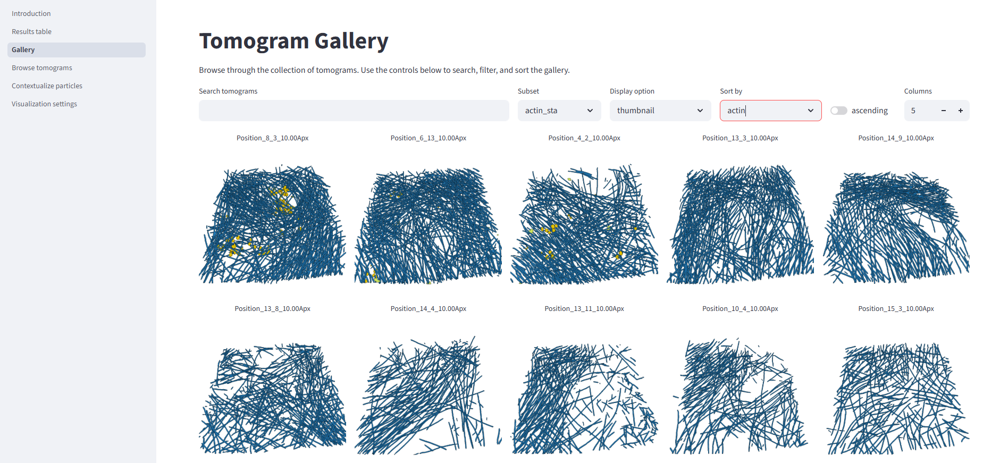

## Example 3: actin filaments in ghost cells

In this example we used **easymode**, **Pom**, **Relion5**, and **M** to reconstruct, denoise, segment, pick, and average actin filaments in human immortalized skin fibroblast 'ghost cells' (plasma membrane removed by surfactant treatment).

??? note "Dataset and computational resources"

    For this test we used 143 tilt series of FIB-milled ghost cells which we collected ourselves. They are not yet available online.  
    We used 4 NVIDIA RTX 4090 GPUs for most processing steps.

At the onset the data consisted of EER frames and mdocs in a single directory. Pixel size was 1.56 Å/px, dose-symmetric tilt series of ±60° with 3° increments and a total dose of 100 electrons/Ų.
```
project_root/
└── raw/            # .mdoc and .eer files
    ├── Position_2_2_001_0.00_20260324_005054_EER.eer
    ├── Position_2_2_002_3.00_20260324_005145_EER.eer
    ├── Position_2_2.mdoc
    └── ...
```

### Step 1: tomogram reconstruction
```
easymode reconstruct --frames raw --mdocs raw --no_halfmaps
```
We now have 143 reconstructed tomograms at 10.00 Å/px in `warp_tiltseries/reconstruction/`.

### Step 2: tomogram denoising
```
easymode denoise --data warp_tiltseries/reconstruction --output denoised --mode direct --method n2n --gpu 0,1,2,3
```
This produced 143 denoised tomograms in `denoised/`.

### Step 3: actin segmentation
```
easymode segment actin --data denoised --output segmented --gpu 0,1,2,3
```

### Step 4: subset selection in Pom

We ran [Pom](../../user_guide/examples/easymode_and_pom.md) to browse the tomograms and segmentation results. The dataset contained so much actin that we did not need all of it -- we selected a subset of 24 high-contrast tomograms, which we called 'actin_sta' in Pom.



### Step 5: filament picking
```
easymode pick actin --data segmented --output coordinates/actin --filament --spacing 150 --subset pom/subsets/actin_sta.txt
```
Unlike in the [microtubule example](microtubule.md), we did not do per-filament averaging here. We did not use the orientation priors from filament tracing either -- we simply picked coordinates at 150 Å spacing along each filament and used them as input for averaging with Warp/Relion5/M. The argument `--subsets pom/subsets/actin_sta.txt` ensures that we pick particles only in the subset of tomograms that we just created.

In a more difficult case (cellular lamella, rather than ghost cells, for example) it may be worth doing per-filament averaging or an initial round of 3D classification with alignment to discard particles that do not align well or are not really actin. In samples with high thickness or tilt series acquired with a relatively low dose, the actin segmentation outputs tend to under-annotate and under-pick actin.

### Step 6: export and initial refinement
```
WarpTools ts_export_particles --input_directory coordinates/actin --input_pattern "*.star" --coords_angpix 10.0 --output_star relion/actin/particles.star --output_angpix 3.0 --box 80 --diameter 100 --2d --relative_output_paths
```
We exported particles at 3 Å/px with a box size of 80 pixels. A single round of Relion5 Refine3D followed by postprocessing reached 6.1 Å.

### Step 7: refinement in M
Refinement in M with `refine_particles`, `refine_imagewarp` (up to 4x4), and `ctf_defocus` + `ctf_defocusexhaustive` brought the resolution to 3.9 Å.

<div style="text-align: center;">
<video autoplay loop muted playsinline controls style="width:100%; max-width:600px; aspect-ratio:16/9; background:#fff; border-radius:8px;">
  <source src="../../../assets/actin_map.mp4" type="video/mp4">
  Video failed to load.
</video>
<p>Subtomogram average at 3.9 Å global resolution, obtained with <code>easymode segment actin</code>, <code>easymode pick actin --filament</code>, and averaging in Relion5/M.</p>
</div>
