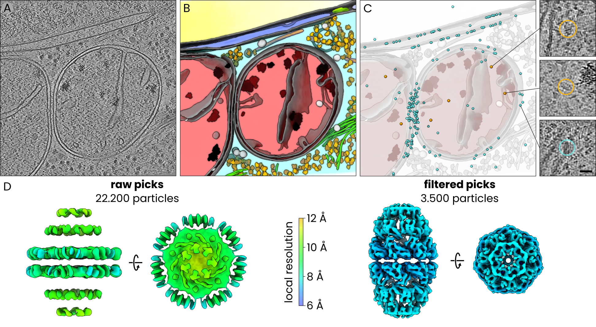

## Co-localization filtering of Hsp60–Hsp10

In this example we used **easymode**, **PyTOM**, **Relion5**, and **M** to segment cellular features, template-match and filter the mitochondrial Hsp60–Hsp10 chaperonin complex, and average it in human cells.

??? note "Dataset and computational resources"

    For this test we used 239 tomograms of FIB-milled H. sapiens (HeLa) cells from [EMPIAR-13145](https://www.ebi.ac.uk/empiar/EMPIAR-13145/).  
    We used 4 NVIDIA RTX 4090 GPUs for most processing steps.

Template matching (TM) is a widely used strategy for particle picking in cryoET, in which a known reference structure is systematically cross-correlated against the tomographic volume to identify instances of the target complex. While it can be highly effective, the resulting particle sets are often contaminated: large, dark features such as ice contamination, membrane fragments, or structurally similar non-target complexes frequently produce high correlation scores. In this tutorial we show how you can use easymode's pretrained networks to filter TM-derived candidate particles.

The dataset comprises 239 tomograms of HeLa cells in which mitochondria are enriched in chaperones due to folding stress, with the Hsp60–Hsp10 complex being particularly abundant. This data was generated and uploaded to EMPIAR by [Ehses et al.](https://www.science.org/doi/10.1126/sciadv.aed3579), who combined template matching and manual annotation of mitochondria to pick and determine the in situ structure of this complex. We replace the manual annotation by automated segmentation.


<div style="text-align: center;">

<p style="font-size:0.85em; font-style:italic; text-align:left;"><b>In situ subtomogram averaging of Hsp60-Hsp10 complexes using PyTom template matching and easymode for particle detection and filtering. A.</b> tomographic slice, <b>B.</b> 3D visualization of easymode network outputs for the tomogram in A, featuring nucleus (yellow), nuclear envelope (blue), nuclear pore complex (green), cytoplasm (cyan), mitochondrion (red), membranes (gray), cytoplasmic granules (light gray), mitochondrial granules (black), ribosomes (yellow), microtubuli (orange), intermediate filaments (green), prohibitin (white). <b>C.</b> Candidate Hsp60-Hsp10 particles (cyan) and selected particles (amber) overlayed on the model of cellular architecture in B. Inset: examples of true positives (top, center) and a false positive pick (bottom). <b>D.</b> Subtomogram averages of the full (left) and filtered (right) particle sets, coloured by approximate local resolution.</p>
</div>


At the onset, the data consisted of MRC frames and mdocs in a single directory:
```
project_root/
└── raw/            
    └── # 16,118 .mrc files + 239 .mdoc files
```

### Step 1: reconstruction and denoising
```
easymode reconstruct --frames raw/ --mdocs raw/ --no_halfmaps
easymode denoise --data warp_tiltseries/reconstruction --output denoised
```

### Step 2: template preparation

We used [EMD-9195](https://www.ebi.ac.uk/emdb/EMD-9195) to generate the template. Since we reconstructed tomograms without contrast inversion (dark signal on a light background, same as in raw micrographs — `WarpTools ts_reconstruct --dont_invert` by default), make sure to invert the template to match this convention:

```
mkdir tm
pytom_create_template.py -i tm/emd_9195.mrc -o tm/template.mrc --input-voxel 1.070 --output-voxel 10.0 --center --box-size 40 --invert
pytom_create_mask.py -b 40 -o tm/mask.mrc --voxel-size 10.00 --radius 15 --sigma 1
```

### Step 3: template matching

We used [PyTom](https://github.com/SBC-Utrecht/pytom-match-pick) for template matching, running the below script in an environment with PyTom installed and on a GPU node.

!!! warning "PyTom version"

    Make sure you are on PyTom version **0.12.1** or more recent. Earlier versions had a bug in parsing Warp tilt series `.xml` files where defocus values were off by a factor of 1e-3, effectively matching with a defocus of 0 and leading to poor scores. Thanks to Marten Chaillet for pointing this out.

```python
import subprocess, os, glob

root = os.getcwd()

tomos = [
    os.path.basename(os.path.splitext(f)[0])
    for f in glob.glob(f'{root}/warp_tiltseries/reconstruction/*10.00Apx*.mrc')
]

os.makedirs('tm/output', exist_ok=True)

for tomo in tomos:
    short = tomo.removesuffix("_10.00Apx")
    subprocess.run([
        "pytom_match_template.py",
        "--particle-diameter", "250",
        "-t", f"{root}/tm/template.mrc",
        "-m", f"{root}/tm/mask.mrc",
        "-v", f"{root}/warp_tiltseries/reconstruction/{tomo}.mrc",
        "-a", f"{root}/warp_tiltseries/tiltstack/{short}/{short}.rawtlt",
        "--warp-xml-file", f"{root}/warp_tiltseries/{short}.xml",
        "--voxel-size-angstrom", "10.0",
        "--tomogram-ctf-model", "phase-flip",
        "--amplitude", "0.08",
        "--spherical", "2.7",
        "--voltage", "300",
        "-g", "0", "1", "2", "3",
        "-d", f"{root}/tm/output",
        "--angular-search", "5.0",
        "--z-axis-rotational-symmetry", "7",
        "-s", "1", "2", "2",
    ])
```

### Step 4: candidate extraction
Once TM completes, extract candidates:

```bash
cd tm/output
for i in *.json; do pytom_extract_candidates.py -j $i -n 1 --tophat-filter; done
```

We then combined the per-tomogram star files into a single particle set:

```bash
cd ../../
starutil tm/output/*.star --output particles_merged.star
```

This yielded a total of ~22,200 candidate Hsp60–Hsp10 particles across the 239 tomograms.

??? tip "`starutil` — a small star file filtering script"

    `starutil` is a simple Python script for filtering and manipulating RELION/Warp star files.
    Save the script below as `starutil.py` and use it as `python starutil.py` (or alias that as `starutil`).

    Requires: `pip install starfile pandas numpy` which should already be included in your easymode environment.

    ```python
    #!/usr/bin/env python
    import argparse
    import operator
    import re
    import starfile
    import sys
    import numpy as np
    import pandas as pd
    from pathlib import Path

    def read_star(star_path):
        data = starfile.read(star_path, always_dict=True)
        if 'particles' in data:
            return data, 'particles'
        keys = list(data.keys())
        if len(keys) == 1:
            return data, keys[0]
        print(f"Available blocks: {keys}")
        sys.exit(1)

    def parse_filter(f):
        m = re.match(r'^(\w+)(>=|<=|!=|>|<|=)(.+)$', f)
        if not m:
            sys.exit(f"Bad filter: {f}")
        col, op_str, val = m.groups()
        ops = {'=': operator.eq, '!=': operator.ne, '>': operator.gt,
               '<': operator.lt, '>=': operator.ge, '<=': operator.le}
        try:
            val = float(val)
            if val == int(val):
                val = int(val)
        except ValueError:
            pass
        return col, ops[op_str], val

    def main():
        parser = argparse.ArgumentParser(description='Star file utility')
        parser.add_argument('star', nargs='+', help='Input star file(s)')
        parser.add_argument('filters', nargs='*')
        parser.add_argument('-o', '--output', help='Output star file')
        args = parser.parse_args()

        star_files = []
        filters = []
        for a in args.star + args.filters:
            if Path(a).suffix == '.star':
                star_files.append(a)
            else:
                filters.append(a)

        all_blocks, pkey = read_star(star_files[0])
        df = all_blocks[pkey]
        print(f"Rows: {len(df)}")

        for f in filters:
            col, op, val = parse_filter(f)
            if col not in df.columns:
                sys.exit(f"Column '{col}' not found")
            df = df[op(df[col], val)].copy()

        print(f"After filtering: {len(df)} rows")
        output = args.output or str(
            Path(star_files[0]).with_stem(
                Path(star_files[0]).stem + '_filtered'))
        all_blocks[pkey] = df
        starfile.write(all_blocks, output, overwrite=True)
        print(f"Written to {output}")

    if __name__ == '__main__':
        main()
    ```

### Step 5: segmentation
Next, we segment mitochondria and a couple of features that we would expect TM to falsely score high on in some cases.
```
easymode segment mitochondrion membrane ice_particle ribosome --data denoised --output segmented --tta 4
```

### Step 6: colocalization filtering

Using the segmentation outputs, we contextualize the particle star file by measuring each particles relation to surrounding mitochondrion, membrane, ribosome, and ice particle segmentations. See the explanation of [Pom contextualize](../../user_guide/pom/contextualizing_particles.md) for more information about this process.

```
pom initialize
pom add_source --tomograms denoised/ --segmentations segemented/
pom contextualize --starfile particles_merged.star --samplers mitochondrion:500 membrane:0.5:1e6 ice_particle:0.5:1e6 ribosome:0.5:1e6 --substitutions .tomostar:_10.00Apx --out_star particles_merged.star
```

We discard particles when they are not inside a mitochondrion and when they are too close (within 50 Å) to membranes, ribosomes, or ice:

```
starutil particles_merged.star "pomMitochondrion500A>0.5" "pomDistMembraneT50>50" "pomDistRibosomeT50>50" "pomDistIceParticleT50>50" --output particles_filtered.star
```

This left us with a selection of just ~3.500 particles.

### Step 7: averaging

We averaged both the unfiltered and filtered particle sets using identical Relion5/M procedures and without any 3D classification. The unfiltered set of 22,200 particles yielded an artefactual map with a nominal resolution of ~11 Å but no genuine structural features, dominated by what appeared to be averaged membrane density. The filtered set of 3.500 particles refined to 8.0 Å resolution and clearly showed the expected Hsp60–Hsp10 complex.
