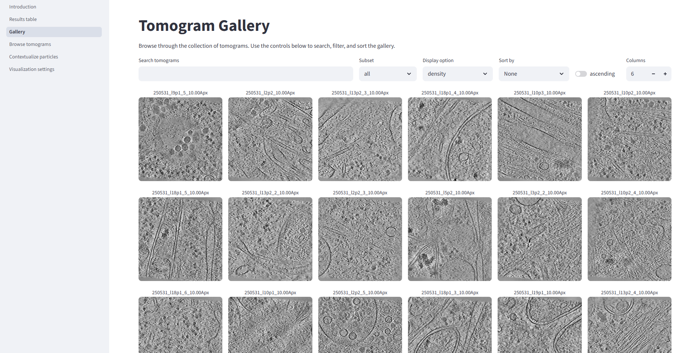
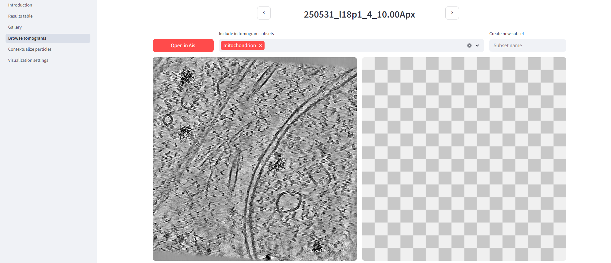
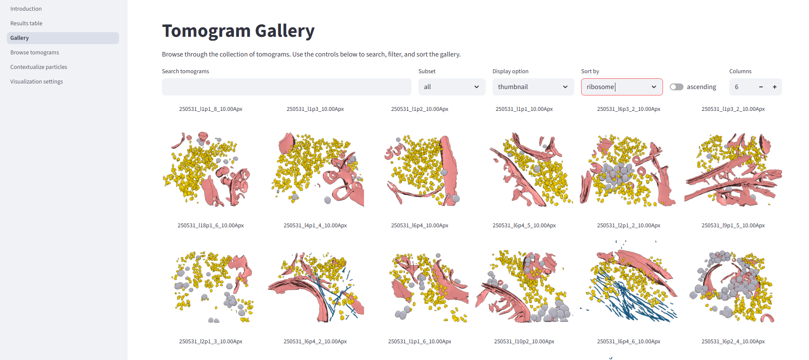
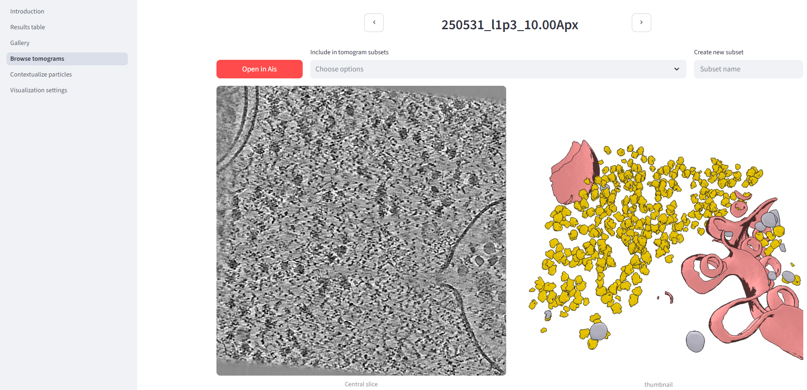

## easymode ❤️ Pom

In this tutorial we'll show you how with easymode and Pom combined you can automatically build a browser-based app to organise and explore your dataset.

We are using a set of 114 tomograms of FIB-milled human (HeLa) cells. The tilt series pixel size was 1.56 Å and volumes are 620x620x310 voxels at 10 Å/px. For the purpose of this tutorial we're starting with the reconstructed and denoised tomograms. These were prepared with 'easymode reconstruct' (WarpTools, AreTomo3) and 'easymode denoise'.

```
project_root/
└── denoised/        # 114 .mrc files
    ├── 250531_l1p1_10.00Apx.mrc
    ├── 250531_l1p1_2_10.00Apx.mrc
    └── ...
```

### Step 1: initializing a Pom project
Initialize the project and let Pom know where to look for tomograms:
```console
$ pom initialize
$ pom add_source --tomograms denoised
```

Then we run a couple of commands to set up the database:
```console
$ pom summarize
Found 114 tomograms
Summarizing 0 segmentations with 128 workers...
0it [00:00, ?it/s]

Summary saved at pom/summary.star
```

```console
$ pom projections
Projecting images for 114 volumes with 32 workers...
100%|██████████████████████████████████| 114/114 [00:12<00:00,  9.28it/s]
```

This will write pom/summary.star, a starfile containing entries for every tomogram in the dataset, and will generate a directory pom/images/density with .png images of the central slice of each tomogram. At that point we run the app:

```console
$ pom browse

  You can now view your Streamlit app in your browser.

  Local URL: http://localhost:8501
  Network URL: http://10.1.4.9:8501
  External URL: http://0.0.0.0:8501
```

And you can open the app in your browser by going to either the local URL (on the same machine) or the network URL (on a different machine connected to the same network). If you're using a VPN to access your institute's network from home, you can also find the app on the external URL.

### Step 2: using the Pom app
At this point the only content in the app will be the previews of the tomograms themselves. The Gallery page will look like this:


Click on any of the tomogram names to enter that tomogram's overview page. And you'll see the thumbnail is missing, because nothing has been segmented yet. You can already start making tomogram subsets - in this example we've included the tomogram in a subset called 'mitochondrion'. Later on, you can run particle picking or segmentation functions on the entire dataset, or on specific subsets only. If you have [Ais](https://github.com/bionanopatterning/Ais) installed, a button 'open in Ais' will be available to open the (annotated) tomogram in Ais. This can be useful is you want to improve a training dataset and are using Pom to inspect preliminary segmentation results.



### Step 3: easymode segmentation
Next we'll segment microtubules, ribosomes, membranes, actin, cytoplasmic granules, and intermediate filaments, as there are lots of these around.

```console
$ easymode segment ribosome membrane microtubule actin cytoplasic_granule intermediate_filament --data denoised/ --tta 2
easymode segment
feature: ribosome
data_patterns: ['denoised/']
output_directory: segmented
output_format: int8
gpus: [0, 1, 2, 3]
tta: 2
overwrite: False
batch_size: 1

Found 114 tomograms to segment.

Using model: /lmb/home/mlast/easymode/ribosome.h5, inference at 10.0 Å/px.

GPU 0 - loading model (/lmb/home/mlast/easymode/ribosome.h5).
GPU 1 - loading model (/lmb/home/mlast/easymode/ribosome.h5).
GPU 2 - loading model (/lmb/home/mlast/easymode/ribosome.h5).
GPU 3 - loading model (/lmb/home/mlast/easymode/ribosome.h5).
```

About 1 hour and 50 minutes later, we end up with 684 segmentation volumes:

```
project_root/
├── denoised/        # 114 .mrc files
│   ├── 250531_l1p1_10.00Apx.mrc
│   ├── 250531_l1p1_2_10.00Apx.mrc
│   └── ...
└── segmented/
    ├── 250531_l1p1_10.00Apx__membrane.mrc
    ├── 250531_l1p1_10.00Apx__microtubule.mrc
    └── ...
```

### Step 4: feeding Pom segmentations
Show Pom where the segmentations can be found:

```
pom add_source --segmentations segmented
```

Now re-run the `summarize` and `projections` commands, and run `render` for 3D visualization:

```console
$ pom summarize
Found 114 tomograms
Summarizing 684 segmentations with 128 workers...
100%|██████████████████████████████████████████| 684/684 [00:35<00:00, 19.10it/s]

Summary saved at pom/summary.star
Added new feature "intermediate_filament" to the feature library.
Added new feature "membrane" to the feature library.
Added new feature "ribosome" to the feature library.
Added new feature "cytoplasmic_granule" to the feature library.
Added new feature "actin" to the feature library.
Added new feature "microtubule" to the feature library.
```

```console
$ pom projections
Projecting images for 798 volumes with 32 workers...
100%|██████████████████████████████████████████| 798/798 [00:28<00:00, 28.35it/s]
```

```console
$ pom render
Rendering 114 tomograms in 1 composition with 64 workers...
100%|██████████████████████████████████████████| 114/114 [00:57<00:00,  1.98it/s]

```
Then launch the browser.

```
pom browse
```

In the Gallery, you can now sort the dataset based on tomogram composition. You can also choose how to preview tomograms - density, segmentation projection, or 3D visualization. Sorting by ribosome content and showing the 3D thumbnails, for example:


The tomogram detail page now also shows more information. 




### Step 5: help us improve?
When using Pom, data is only ever stored locally and nothing is exposed to the internet. Only to your network.

But, if you want to, it is possible to submit volumes to the easymode training collection through Pom. At the bottom of any tomogram detail page there is a form you can use to do so. If you think some segmentation networks need to be improved, please help us by writing a comment (like 'the membrane looks bad') and submitting the volume! If you're feeling particularly generous, note that you are limited to 10 uploads an hour and 50 per day because we have finite server capacity.