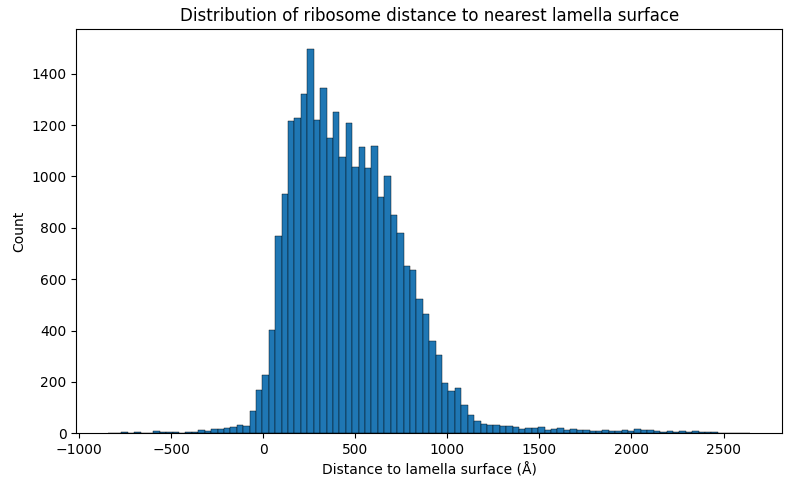
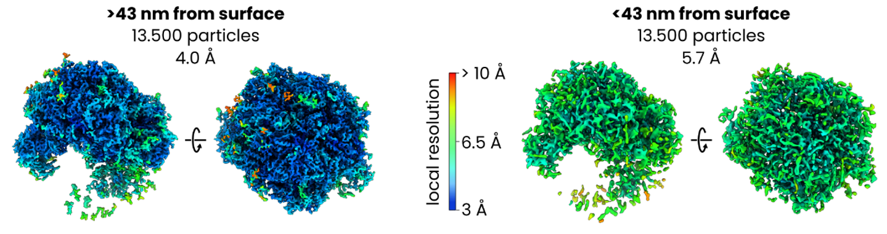

# Lamella surface distance filtering

In this example we'll use data from [EMPIAR-11899](https://www.ebi.ac.uk/empiar/EMPIAR-11899/). When we originally did this test we used versions of the ribosome and void networks that had been trained with this dataset excluded from the training collection. The current versions were trained on the full collection.

This data was originally generated by [Tuijtel et al.](https://www.science.org/doi/10.1126/sciadv.adk6285) who used it to investigate the effect of cryoFIB-milling-induced surface damage on subtomogram averaging quality in detail. We are re-using their data to show how pretrained networks (for void and ribosomes) can be used to achieve the same results.

We'll start with segmentation, with denoised reconstructions already in warp_tiltseries/reconstruction/denoised. There are 207 tomograms in the dataset.

## Segmenting ribosomes and void
First, we segment ribosomes and void. For the void segmentation we use the 2D model (which is the one for which validation metrics are shown in the paper) and the maximum degree of test-time augmentation. For ribosomes we'll keep everything at default settings.

```
easymode segment ribosome --data warp_tiltseries/reconstruction/denoised --output segmented/
easymode segment void --data warp_tiltseries/reconstruction/denoised --2d --tta 8 --output segmented/
```

## Subtomogram averaging of ribosome
We refer to the [ribosome STA tutorial](ribosome.md) for more details on this step. In short, we pick ribosomes using:

```
easymode pick ribosome --data segmented --size 2000000 --spacing 250
```

With a minimum blob size of 2e6 ų and a minimum 250 Å spacing between particles. After exporting particles at 5 Å/px with WarpTools ts_export_particles and averaging in Relion5 to around 10 Å resolution, the particles should have settled into position.

## Measuring the distance to the nearest lamella
Next, we wanted to measure the distance from each ribosome coordinate to the nearest lamella surface. We use the void segmentations (which annotate the regions of the tomogram that are not biological material - i.e., the void outside of the lamella) to identify these surfaces, and Pom to do the measurement. First, set up Pom:

```
pom initialize
pom add_source --tomograms warp_tiltseries/reconstruction/denoised
pom add_source --segmentations segmented
```

Then for the measurement (see [this page](../pom/contextualizing_particles.md) for more details about using Pom), we define a sampler that measures distance (in Å) to the nearest void surface (void segmentation output thresholded at 0.5, or half the maximum network output value). We only take the two largest objects in the void mesh in to account, to avoid small spurious void output blobs within the lamella introducing errors in the measurement.

```console
$ pom contextualize \
    --starfile relion/ribosome/Refine3D/job001/run_data.star \
    --samplers void:0.5:-2 \
    --substitutions .tomostar:_10.00Apx.mrc \
    --out_star ribosomes_pom.star

Contextualizing 27399 particles with 1 samplers:
  1. pomDistVoidT50: distance to void
     (threshold=0.5, keeping only 2 largest blob(s)).

found 207 volumes for feature "void".

sampling context for 207 tomograms with 32 workers.
  100%|████████████████████| 207/207 [01:39<00:00, 2.09it/s]
```

## Splitting the particle set
We now have `ribosome_pom.star` with all the original particle coordinates and angles, plus a new column called 'pomDistVoidT50' which lists the distance from each particle to what we defined as the nearest lamella surface. 



The median distance was 435 Å, so we split the set into two halves with:

```
starutil ribosomes_pom.star "pomDistVoidT50<435" --output ribosomes_surface.star
starutil ribosomes_pom.star "pomDistVoidT50>435" --output ribosomes_central.star
```

??? tip "`starutil` — a small star file filtering script"

    `starutil` is a simple Python script for filtering and manipulating RELION/Warp star files.
    Save the script below as `starutil.py` and use it as `python starutil.py` (or alias it as `starutil`).

    Requires: `pip install starfile pandas numpy`

    ```python
    #!/usr/bin/env python
    import argparse
    import operator
    import re
    import starfile
    import sys
    import numpy as np
    import pandas as pd
    from pathlib import Path
    
    WIDTH = 80
    HEIGHT = 20
    
    def read_star(star_path):
        """Return (full_dict, particle_key)."""
        data = starfile.read(star_path, always_dict=True)
        if 'particles' in data:
            return data, 'particles'
        keys = list(data.keys())
        if len(keys) == 1:
            return data, keys[0]
        print(f"Available blocks: {keys}")
        sys.exit(1)
    
    def parse_filter(f):
        m = re.match(r'^(\w+)(>=|<=|!=|>|<|=)(.+)$', f)
        if not m:
            sys.exit(f"Bad filter: {f}")
        col, op_str, val = m.groups()
        ops = {'=': operator.eq, '!=': operator.ne, '>': operator.gt,
                '<': operator.lt, '>=': operator.ge, '<=': operator.le}
        try:
            val = float(val)
            if val == int(val):
                val = int(val)
        except ValueError:
            pass
        return col, ops[op_str], val
    
    def parse_substitute(s):
        parts = s.split(':', 2)
        if len(parts) != 3:
            sys.exit(f"Bad substitution (need col:search:replace): {s}")
        return parts
    
    def parse_scale(s):
        parts = s.split(':', 1)
        if len(parts) != 2:
            sys.exit(f"Bad scale (need col:factor): {s}")
        col, factor = parts
        try:
            factor = float(factor)
        except ValueError:
            sys.exit(f"Bad scale factor: {factor}")
        return col, factor
    
    def print_histogram(series, name):
        print(f"\n{'─' * WIDTH}")
        print(f"  {name}  (n={len(series)}, non-null={series.notna().sum()})")
        print(f"{'─' * WIDTH}")
    
        s = series.dropna()
        if len(s) == 0:
            print("  (all NaN)")
            return
    
        if pd.api.types.is_numeric_dtype(s):
            _numeric_histogram(s, name)
        else:
            _categorical_histogram(s, name)
    
    def _numeric_histogram(s, name):
        lo, hi = s.min(), s.max()
        mean, std, med = s.mean(), s.std(), s.median()
        print(f"  min={lo:.4g}  max={hi:.4g}  mean={mean:.4g}  std={std:.4g}  median={med:.4g}")
        print()
    
        if lo == hi:
            print(f"  all values = {lo}")
            return
    
        is_int = pd.api.types.is_integer_dtype(s) or (s == s.round()).all()
    
        if is_int:
            lo_i, hi_i = int(lo), int(hi)
            bins = np.arange(lo_i - 0.5, hi_i + 1.5, 1.0)
            counts, _ = np.histogram(s, bins=bins)
            labels = [str(v) for v in range(lo_i, hi_i + 1)]
        else:
            nbins = min(HEIGHT, len(s.unique()))
            counts, edges = np.histogram(s, bins=nbins)
            labels = [f"{edges[i]:.3g}" for i in range(len(counts))]
    
        max_count = counts.max()
        if max_count == 0:
            return
    
        label_w = max(len(l) for l in labels)
        bar_w = WIDTH - label_w - 10
    
        for label, c in zip(labels, counts):
            bar_len = int(c / max_count * bar_w)
            print(f"  {label.rjust(label_w)} │{'█' * bar_len} {c}")
    
    def _categorical_histogram(s, name):
        vc = s.value_counts()
        n_show = min(HEIGHT, len(vc))
        vc = vc.head(n_show)
        max_count = vc.iloc[0]
    
        label_w = min(30, max(len(str(v)) for v in vc.index))
        bar_w = WIDTH - label_w - 10
    
        for val, c in vc.items():
            lbl = str(val)[:label_w].ljust(label_w)
            bar_len = int(c / max_count * bar_w)
            bar = '█' * bar_len
            print(f"  {lbl} │{bar} {c}")
    
        if len(s.value_counts()) > n_show:
            print(f"  ... and {len(s.value_counts()) - n_show} more unique values")
    
    def main():
        parser = argparse.ArgumentParser(description='Star file utility')
        parser.add_argument('star', nargs='+', help='Input star file(s) (multiple for merge)')
        parser.add_argument('filters', nargs='*')
        parser.add_argument('-o', '--output', help='Output star file')
        parser.add_argument('--substitute', action='append', metavar='col:search:replace',
                            help='String substitution in column (repeatable)')
        parser.add_argument('--scale', action='append', metavar='col:factor',
                            help='Multiply numeric column by constant (repeatable)')
        parser.add_argument('--drop', nargs='+', metavar='COL',
                            help='Remove one or more columns from the dataframe')
        parser.add_argument('--histogram', metavar='COL', help='Print value counts for column')
        parser.add_argument('--stats', metavar='COL', nargs='+',
                            help='Print histogram stats for column(s)')
        args = parser.parse_args()
    
        star_files = []
        filters = []
        for a in args.star + args.filters:
            if Path(a).suffix == '.star':
                star_files.append(a)
            else:
                filters.append(a)
    
        merging = len(star_files) > 1
    
        if merging:
            dfs = []
            for sf in star_files:
                all_blocks, pkey = read_star(sf)
                dfs.append(all_blocks[pkey])
                print(f"  {sf}: {len(all_blocks[pkey])} rows")
            df = pd.concat(dfs, ignore_index=True)
            all_blocks = None  # no extra blocks preserved for merge
            print(f"Merged: {len(df)} rows")
        else:
            all_blocks, pkey = read_star(star_files[0])
            df = all_blocks[pkey]
            print(f"Rows: {len(df)}")
            print(f"Columns: {', '.join(df.columns)}")
            if len(all_blocks) > 1:
                print(f"Blocks: {', '.join(all_blocks.keys())} (editing '{pkey}')")
    
        no_ops = not any([filters, args.substitute, args.scale, args.drop, args.histogram, args.stats, merging])
    
        if no_ops:
            return
    
        for f in filters:
            col, op, val = parse_filter(f)
            if col not in df.columns:
                sys.exit(f"Column '{col}' not found")
            df = df[op(df[col], val)].copy()
    
        for s in (args.substitute or []):
            col, search, replace = parse_substitute(s)
            if col not in df.columns:
                sys.exit(f"Column '{col}' not found")
            df[col] = df[col].astype(str).str.replace(search, replace, regex=False)
    
        for s in (args.scale or []):
            col, factor = parse_scale(s)
            if col not in df.columns:
                sys.exit(f"Column '{col}' not found")
            df[col] = df[col] * factor
    
        if args.drop:
            for col in args.drop:
                if col in df.columns:
                    df = df.drop(columns=[col])
                    print(f"Dropped column: {col}")
                else:
                    print(f"Warning: Column '{col}' not found, skipping drop.")
    
        if args.histogram:
            if args.histogram not in df.columns:
                sys.exit(f"Column '{args.histogram}' not found")
            for val, count in df[args.histogram].value_counts().items():
                print(f"  {val}: {count}")
            return
    
        if args.stats:
            for col in args.stats:
                if col not in df.columns:
                    sys.exit(f"Column '{col}' not found")
                print_histogram(df[col], col)
            return
    
        print(f"After operations: {len(df)} rows")
    
        if merging:
            default_out = str(Path(star_files[0]).with_stem(Path(star_files[0]).stem + '_merged'))
        else:
            default_out = str(Path(star_files[0]).with_stem(Path(star_files[0]).stem + '_filtered'))
        output = args.output or default_out
    
        if merging or all_blocks is None or len(all_blocks) == 1:
            out_data = {'particles': df}
        else:
            all_blocks[pkey] = df
            out_data = all_blocks
    
        starfile.write(out_data, output, overwrite=True)
        print(f"Written to {output}")
    
    if __name__ == '__main__':
        main()
    ```

And as in the earlier ribosome refinement in M, made a population and source and added two species, one using each of the half particle sets. After refinement of the particle poses, CTF, and image warp, this resulted in maps at 4.0 Å for the central 50% of particles and 5.7 Å for the 50% of particles closest to the lamella surface.

