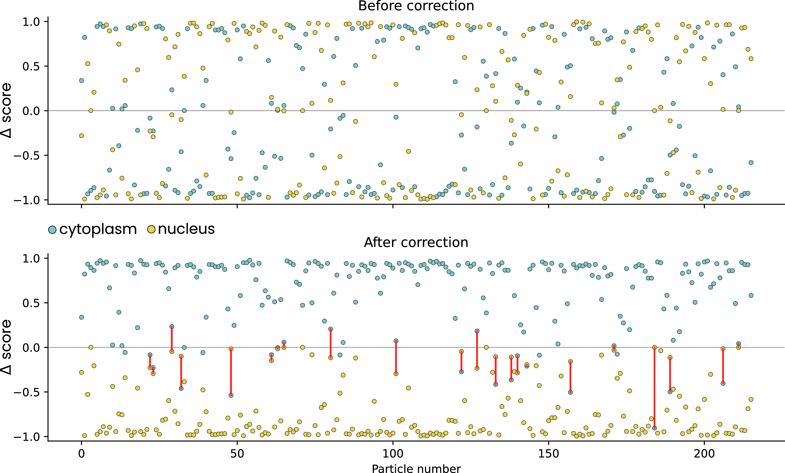

## NPC + cytoplasm + nucleus

In this example we used **easymode**, **Pom**, **Warp**, and **RELION5** to segment, pick, orient, and average nuclear pore complexes (NPCs) in *D. discoideum* cells.

??? note "Dataset and computational resources"

    We used 130 tilt series of FIB-milled *D. discoideum* lamellae from [EMPIAR-11943](https://www.ebi.ac.uk/empiar/EMPIAR-11943/), originally collected by Hoffman *et al.* to study NPC dilation under osmotic stress. Tomograms were reconstructed using Warp at 10 Å/px and denoised with the easymode general denoiser. We used a node with four RTX3090 GPUs for processing.

### Step 1: segmentation

We segment three features: NPC (for picking), cytoplasm, and nucleus (for orientation correction later).

```
easymode segment npc cytoplasm nucleus --data denoised --output segmented 
```

### Step 2: picking

```
easymode pick npc --data segmented --output coordinates/npc --spacing 900 --centroid
```

The `--centroid` flag places each coordinate at the centroid of the detected blob rather than at its deepest point (i.e. the maximum of the distance transform). This matters for NPCs because the NPC segmentation is shaped like a flat slab rather than a compact sphere. Without `--centroid`, the coordinate is placed at the point farthest from the edge of the blob, which for a flat slab can end up at a position far from the actual center. In turn, this can defeat the minimum particle spacing: if one NPC's coordinate lands at its far end by chance, a second coordinate within the same NPC can be placed within the `--spacing` radius, resulting in a duplicate pick. Both will be quite far from the actual center of the pore. Using `--centroid` avoids this.

!!! warning
    `--centroid` should not be used when segmented blobs may be touching or overlapping, as is common for ribosomes. In those cases, the centroid of a merged blob would fall between the two particles.

This yielded 216 NPC coordinates across 130 tomograms, without priors on the orientation.

### Step 3: initial averaging in RELION5

We exported particles at 10 Å/px with a box size of 220 px:

```
WarpTools ts_export_particles --input_directory coordinates/npc --input_pattern "*.star" --coords_angpix 10.0 --output_star relion/npc/particles.star --output_angpix 10.0 --box 220 --diameter 900 --3d --relative_output_paths
```

We then ran a RELION5 Refine3D job with global angular search starting at 15°, using no prior on the orientation. This initial refinement reached 55 Å resolution using C8 symmetry.

The problem with NPCs at low resolution is that the cytoplasmic and nuclear sides are very similar and alignment without a prior is generally not able to resolve them. Instead it converges on roughly correct global orientations, except that the orientation may be flipped by 180°. 

### Step 4: orientation correction with Pom

This is where `pom contextualize` comes in. We use the easymode cytoplasm and nucleus segmentations to determine which side of each NPC faces the cytoplasm and which faces the nucleus, and flip the particle orientation accordingly.

First, set up Pom and register the data sources:
```
pom initialize
pom add_source --tomograms denoised --segmentations segmented
```

Then, contextualize the particles:
```
pom contextualize \
    --starfile relion/npc/Refine3D/job001/run_data.star \
    --samplers cytoplasm:500:+500 cytoplasm:500:-500 nucleus:500:-500 nucleus:500:+500 \
    --substitutions .tomostar:_10.00Apx \
    --out_star npc_pom.star
```

The `--samplers` argument defines four volumetric measurements per particle. Each volume sampler has the format `feature:radius:offset`:

- **`feature`** — which segmentation volume to sample (here, `cytoplasm` or `nucleus`).
- **`radius`** — the radius (in Å) of a spherical region within which the segmentation values are averaged.
- **`offset`** — a position offset (in Å) along the particle's primary axis (+Z in local particle space). `+500` means 500 Å "in front of" the particle (along +Z), `-500` means 500 Å "behind" it.

So for each NPC, we measure the average cytoplasm and nucleus segmentation values within a sphere of 500 Å radius both 500 Å in front of and 500 Å behind the particle. The output is a STAR file with four new columns appended to each particle:

```
pomCytoplasm500Ap500   — cytoplasm, 500 Å in front
pomCytoplasm500Am500   — cytoplasm, 500 Å behind
pomNucleus500Am500     — nucleus, 500 Å behind
pomNucleus500Ap500     — nucleus, 500 Å in front
```

### Step 5: flipping misoriented particles

With these measurements, we can determine and correct the orientation of each particle. For a correctly oriented NPC, we expect high cytoplasm values in front and high nucleus values behind (or vice versa, depending on your convention). A particle that needs flipping will show the opposite pattern.

We compute the difference `front − back` for both cytoplasm and nucleus. Before correction, these differences are scattered randomly above and below zero. After flipping the misoriented particles (by rotating the Euler angles by 180°), both signals should separate cleanly:



Particles for which neither cytoplasm nor nucleus gave a clear consensus on orientation were discarded. Here we considered particles ambiguous when the cytoplasm score was < 0.3 *and* the nucleus score > -0.3 - this was the case for 22 out of 216 particles.

### Step 6: refinement

After writing the corrected orientations back to the STAR file and removing ambiguous particles, we ran a second RELION5 Refine3D job. The resulting map improved from 55 Å to 36 Å resolution.

<br>
<p style="text-align:center;">
  <video autoplay loop muted playsinline controls style="width:100%; max-width:720px; aspect-ratio:16/9; background:#fff; border-radius:8px; display:block; margin:auto;">
    <source src="../../../assets/npc_map.mp4" type="video/mp4">
    Video failed to load.
  </video>
</p>
Subtomogram average obtained with `easymode segment npc` and `easymode pick npc` and averaging in RELION5.
