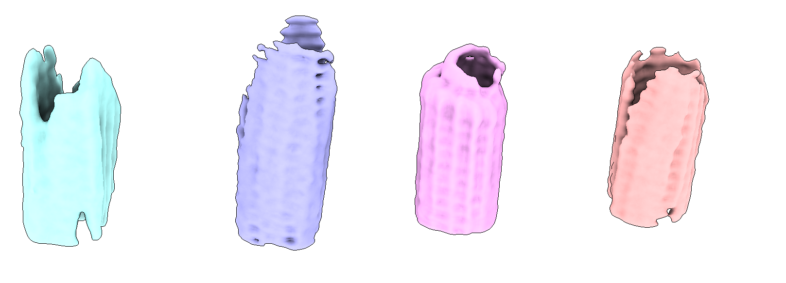
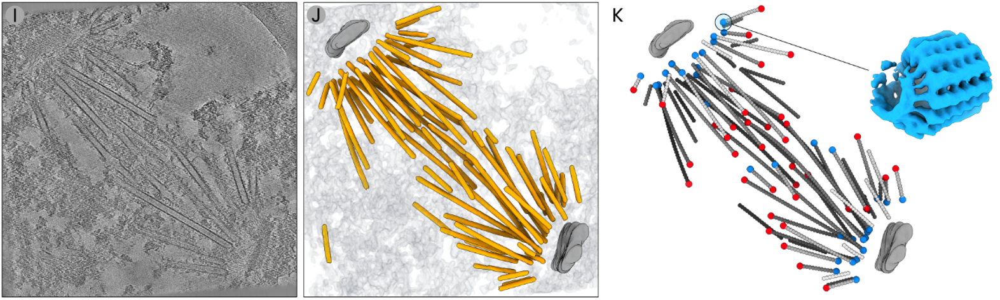

## Picking γTuRC

In this example we used **easymode**, **Warp**, **RELION5**, and **M** to segment, pick, and average γ-tubulin ring complexes (γTuRC) from microtubule minus ends in purified *S. uvarum* spindle pole bodies.


### Step 1: microtubule tracing & averaging

See the [microtubule STA tutorial](microtubule.md) for the first steps of this workflow: tomogram reconstruction, segmentation, and per-filament picking and averaging. In this case we ended up with 4508 individual averages, the central slices of which were saved to directory `polarity_imgs/<filament_name>.mrc`

### Step 2: automated assignment of microtubule polarity

The next task is to determine the polarity of each filament — i.e., whether it is correctly aligned to the reference, or flipped 180° relative to it.

Because 4508 maps are too many to manually inspect, we needed some tool to help us automate this. This is the type of task that it would take some time to write software for, but where the eventual predictions are in fact very easy to validate. **Hard to do but easy to validate = [LLM](https://en.wikipedia.org/wiki/Large_language_model) territory:** we asked [Claude](https://claude.ai/) to create an app that we could use to label a subset of filament cross sections, to train a classifier, and to run inference on the whole dataset.

??? note "polarity_tool.py"
    ```python
    #!/usr/bin/env python
    """Microtubule polarity classification tool.

    Usage:
        python polarity_tool.py label     # manually label cross-sections (GUI)
        python polarity_tool.py train     # train L/R/0 classifier
        python polarity_tool.py predict   # batch prediction on all images
        python polarity_tool.py review    # review/correct predictions (GUI)
    """

    import argparse, os, csv, glob, random
    import numpy as np
    import mrcfile
    import torch
    import torch.nn as nn
    from torch.utils.data import Dataset, DataLoader
    from scipy.ndimage import rotate, gaussian_filter

    MRC_DIR = "polarity_imgs"
    LABELS_FILE = "polarity_labels.csv"
    MODEL_FILE = "polarity_model.pt"
    PREDICTIONS_FILE = "polarity_predictions.csv"
    IMG_SIZE = 64
    LABEL_MAP = {"L": 0, "R": 1, "0": 2}
    INV_LABEL_MAP = {v: k for k, v in LABEL_MAP.items()}


    # ── Utilities ──────────────────────────────────────────────────────

    def pad_or_crop(img, size):
        h, w = img.shape
        if h < size or w < size:
            ph, pw = max(size - h, 0), max(size - w, 0)
            img = np.pad(img, ((ph // 2, ph - ph // 2), (pw // 2, pw - pw // 2)),
                        mode="constant")
            h, w = img.shape
        y0, x0 = (h - size) // 2, (w - size) // 2
        return img[y0:y0 + size, x0:x0 + size]


    def normalize(img):
        mu, std = img.mean(), img.std()
        return (img - mu) / (std + 1e-8)


    def load_labels():
        labels = {}
        if os.path.exists(LABELS_FILE):
            with open(LABELS_FILE) as f:
                for row in csv.reader(f):
                    if len(row) == 2:
                        labels[row[0]] = row[1]
        return labels


    # ── Model ──────────────────────────────────────────────────────────

    class SmallCNN(nn.Module):
        def __init__(self):
            super().__init__()
            self.conv = nn.Sequential(
                nn.Conv2d(1, 32, 3, padding=1), nn.BatchNorm2d(32), nn.ReLU(),
                nn.MaxPool2d(2),
                nn.Conv2d(32, 64, 3, padding=1), nn.BatchNorm2d(64), nn.ReLU(),
                nn.MaxPool2d(2),
                nn.Conv2d(64, 128, 3, padding=1), nn.BatchNorm2d(128), nn.ReLU(),
                nn.AdaptiveAvgPool2d(1),
            )
            self.head = nn.Sequential(nn.Dropout(0.3), nn.Linear(128, 3))

        def forward(self, x):
            return self.head(self.conv(x).flatten(1))


    def load_model(device):
        model = SmallCNN().to(device)
        model.load_state_dict(torch.load(MODEL_FILE, map_location=device,
                                        weights_only=True))
        model.eval()
        return model


    def predict_image(model, data, device):
        d = pad_or_crop(data.astype(np.float32), IMG_SIZE)
        d = normalize(d)
        x = torch.tensor(d[None, None], dtype=torch.float32, device=device)
        with torch.no_grad():
            probs = torch.softmax(model(x), dim=1)[0]
        pred = INV_LABEL_MAP[probs.argmax().item()]
        prob_dict = {INV_LABEL_MAP[i]: probs[i].item() for i in range(3)}
        return pred, prob_dict


    def read_mrc(path):
        with mrcfile.open(path, permissive=True) as m:
            d = m.data.copy().astype(np.float32)
        if d.ndim == 3:
            d = d[0]
        return d


    # ── Label ──────────────────────────────────────────────────────────

    def cmd_label():
        import tkinter as tk
        from matplotlib.backends.backend_tkagg import FigureCanvasTkAgg
        from matplotlib.figure import Figure

        class Labeler:
            def __init__(self):
                self.files = sorted(glob.glob(os.path.join(MRC_DIR, "*.mrc")))
                self.labels = load_labels()
                self.unlabelled = [f for f in self.files
                                if os.path.basename(f) not in self.labels]
                self.idx = 0
                self.device = torch.device(
                    "cuda" if torch.cuda.is_available() else "cpu")
                self.model = load_model(self.device)

                self.root = tk.Tk()
                self.root.title("MT Polarity Labeler")
                self.fig = Figure(figsize=(5, 5))
                self.ax = self.fig.add_subplot(111)
                self.canvas = FigureCanvasTkAgg(self.fig, self.root)
                self.canvas.get_tk_widget().pack()
                self.pred_label = tk.Label(self.root, text="",
                                        font=("monospace", 18, "bold"))
                self.pred_label.pack(pady=2)
                self.status = tk.Label(self.root, text="",
                                    font=("monospace", 14))
                self.status.pack(pady=5)
                self.root.bind("<KeyPress>", self._on_key)
                self._show()
                self.root.mainloop()

            def _save_label(self, fname, label):
                self.labels[fname] = label
                with open(LABELS_FILE, "a") as f:
                    csv.writer(f).writerow([fname, label])

            def _show(self):
                self.ax.clear()
                if self.idx >= len(self.unlabelled):
                    self.ax.set_title("All done!", fontsize=16)
                    self.ax.axis("off")
                    self.canvas.draw()
                    self.pred_label.config(text="")
                    self.status.config(
                        text=f"Labelled {len(self.labels)}/{len(self.files)}")
                    return
                path = self.unlabelled[self.idx]
                data = read_mrc(path)
                pred, probs = predict_image(self.model, data, self.device)
                self.ax.imshow(data, cmap="inferno", origin="lower")
                self.ax.set_title(os.path.basename(path), fontsize=11)
                self.ax.axis("off")
                self.fig.tight_layout()
                self.canvas.draw()
                prob_str = "  ".join(
                    f"{k}:{v:.0%}" for k, v in sorted(probs.items()))
                self.pred_label.config(text=f"Model: {pred}   ({prob_str})")
                remaining = len(self.unlabelled) - self.idx
                self.status.config(
                    text=f"Remaining: {remaining} | "
                        f"Labelled: {len(self.labels)}/{len(self.files)} | "
                        f"L / R / 0 | U=undo  Q=quit")

            def _on_key(self, event):
                key = event.keysym.upper()
                if key in ("L", "R", "0"):
                    fname = os.path.basename(self.unlabelled[self.idx])
                    self._save_label(fname, key)
                    self.idx += 1
                    self._show()
                elif key == "U" and self.idx > 0:
                    self.idx -= 1
                    fname = os.path.basename(self.unlabelled[self.idx])
                    self.labels.pop(fname, None)
                    with open(LABELS_FILE, "w") as f:
                        w = csv.writer(f)
                        for k, v in self.labels.items():
                            w.writerow([k, v])
                    self._show()
                elif key == "Q":
                    self.root.destroy()

        Labeler()


    # ── Train ──────────────────────────────────────────────────────────

    def cmd_train():
        from collections import defaultdict

        def augment(img, label):
            k = random.randint(0, 3)
            img = np.rot90(img, k).copy()
            angle = random.uniform(0, 360)
            img = rotate(img, angle, reshape=False, order=1)
            if random.random() < 0.5:
                img = np.flip(img, axis=random.choice([0, 1])).copy()
                if label == 0: label = 1
                elif label == 1: label = 0
            if random.random() < 0.5:
                img = gaussian_filter(img, sigma=random.uniform(0.5, 2.0))
            return img, label

        class MTDataset(Dataset):
            def __init__(self, imgs, labels, aug=True):
                self.imgs, self.labels, self.aug = imgs, labels, aug
            def __len__(self): return len(self.imgs)
            def __getitem__(self, i):
                img, lab = self.imgs[i].copy(), self.labels[i]
                img = pad_or_crop(img, IMG_SIZE)
                if self.aug:
                    img, lab = augment(img, lab)
                    img = pad_or_crop(img, IMG_SIZE)
                img = normalize(img)
                return torch.tensor(img[None], dtype=torch.float32), lab

        labels = load_labels()
        imgs, ys = [], []
        for fname, lab in labels.items():
            path = os.path.join(MRC_DIR, fname)
            if not os.path.exists(path): continue
            imgs.append(read_mrc(path))
            ys.append(LABEL_MAP[lab])
        print(f"Loaded {len(imgs)} labelled images")
        counts = {INV_LABEL_MAP[i]: ys.count(i) for i in range(3)}
        print(f"Class distribution: {counts}")

        by_class = defaultdict(list)
        for i, l in enumerate(ys):
            by_class[l].append(i)
        train_idx, val_idx = [], []
        for cls, idxs in by_class.items():
            random.shuffle(idxs)
            split = max(1, int(0.8 * len(idxs)))
            train_idx.extend(idxs[:split])
            val_idx.extend(idxs[split:])

        train_dl = DataLoader(MTDataset([imgs[i] for i in train_idx],
                                        [ys[i] for i in train_idx], aug=True),
                            batch_size=16, shuffle=True)
        val_dl = DataLoader(MTDataset([imgs[i] for i in val_idx],
                                    [ys[i] for i in val_idx], aug=False),
                            batch_size=16, shuffle=False)

        device = torch.device("cuda" if torch.cuda.is_available() else "cpu")
        model = SmallCNN().to(device)
        opt = torch.optim.AdamW(model.parameters(), lr=2e-4, weight_decay=1e-4)
        scheduler = torch.optim.lr_scheduler.CosineAnnealingLR(opt, 150)

        weights = torch.tensor([1.0 / max(ys.count(i), 1) for i in range(3)],
                            device=device)
        weights = weights / weights.sum() * 3
        criterion = nn.CrossEntropyLoss(weight=weights)

        best_val = 0
        for ep in range(150):
            model.train()
            losses = []
            for x, y in train_dl:
                x, y = x.to(device), torch.tensor(y, device=device)
                loss = criterion(model(x), y)
                opt.zero_grad(); loss.backward(); opt.step()
                losses.append(loss.item())
            scheduler.step()
            model.eval()
            correct = total = 0
            with torch.no_grad():
                for x, y in val_dl:
                    x, y = x.to(device), torch.tensor(y, device=device)
                    correct += (model(x).argmax(1) == y).sum().item()
                    total += len(y)
            val_acc = correct / max(total, 1)
            if (ep + 1) % 10 == 0 or val_acc > best_val:
                print(f"Epoch {ep+1:3d}  loss={np.mean(losses):.4f}"
                    f"  val_acc={val_acc:.3f}")
            if val_acc >= best_val:
                best_val = val_acc
                torch.save(model.state_dict(), MODEL_FILE)
        print(f"\nBest val accuracy: {best_val:.3f}")


    # ── Predict ────────────────────────────────────────────────────────

    def cmd_predict():
        device = torch.device("cuda" if torch.cuda.is_available() else "cpu")
        model = load_model(device)
        gt = load_labels()
        files = sorted(glob.glob(os.path.join(MRC_DIR, "*.mrc")))

        rows = []
        for j, path in enumerate(files, 1):
            data = read_mrc(path)
            d = normalize(pad_or_crop(data, IMG_SIZE))
            x = torch.tensor(d[None, None], dtype=torch.float32, device=device)
            with torch.no_grad():
                probs = torch.softmax(model(x), dim=1)[0].cpu().numpy()
            fname = os.path.basename(path)
            rows.append({
                "filename": fname,
                "gt": gt.get(fname, ""),
                "pred": INV_LABEL_MAP[int(probs.argmax())],
                "confidence": float(probs.max()),
                "prob_L": float(probs[0]),
                "prob_R": float(probs[1]),
                "prob_0": float(probs[2]),
            })
            if j % 500 == 0:
                print(f"  {j}/{len(files)}")

        with open(PREDICTIONS_FILE, "w", newline="") as f:
            w = csv.DictWriter(f, fieldnames=[
                "filename", "gt", "pred", "confidence",
                "prob_L", "prob_R", "prob_0"])
            w.writeheader()
            w.writerows(rows)
        print(f"Saved {len(rows)} predictions to {PREDICTIONS_FILE}")

        preds = np.array([r["pred"] for r in rows])
        confs = np.array([r["confidence"] for r in rows])
        for c in ["L", "R", "0"]:
            n = (preds == c).sum()
            print(f"  {c}: {n} ({n/len(preds):.1%})")
        print(f"Mean confidence: {confs.mean():.3f}")


    # ── Review ─────────────────────────────────────────────────────────

    def cmd_review():
        import tkinter as tk
        from matplotlib.backends.backend_tkagg import FigureCanvasTkAgg
        from matplotlib.figure import Figure

        CONF_THRESHOLD = 0.85

        class Reviewer:
            def __init__(self):
                self.all_rows = self._load()
                self.queue, self.idx = [], 0

                self.root = tk.Tk()
                self.root.title("MT Polarity Reviewer")

                fbar = tk.Frame(self.root)
                fbar.pack(fill="x", padx=5, pady=5)
                tk.Label(fbar, text="Filter:").pack(side="left")
                self.filter_var = tk.StringVar(value="low_conf")
                for val, txt in [
                    ("low_conf", f"Low conf (<{CONF_THRESHOLD})"),
                    ("disagree", "GT ≠ pred"), ("no_gt", "No GT"),
                    ("all", "All")]:
                    tk.Radiobutton(fbar, text=txt, variable=self.filter_var,
                                value=val,
                                command=self._apply_filter).pack(
                                    side="left", padx=4)
                tk.Label(fbar, text="  Class:").pack(side="left")
                self.class_var = tk.StringVar(value="any")
                for val in ["any", "L", "R", "0"]:
                    tk.Radiobutton(fbar, text=val, variable=self.class_var,
                                value=val,
                                command=self._apply_filter).pack(
                                    side="left", padx=2)

                self.fig = Figure(figsize=(5, 5))
                self.ax = self.fig.add_subplot(111)
                self.canvas = FigureCanvasTkAgg(self.fig, self.root)
                self.canvas.get_tk_widget().pack()
                self.info_label = tk.Label(self.root, text="",
                                        font=("monospace", 16, "bold"))
                self.info_label.pack(pady=2)
                self.prob_label = tk.Label(self.root, text="",
                                        font=("monospace", 14))
                self.prob_label.pack(pady=2)
                self.status = tk.Label(self.root, text="",
                                    font=("monospace", 12))
                self.status.pack(pady=5)
                self.root.bind("<KeyPress>", self._on_key)
                self._apply_filter()
                self.root.mainloop()

            def _load(self):
                rows = []
                with open(PREDICTIONS_FILE) as f:
                    for r in csv.DictReader(f):
                        for k in ("confidence", "prob_L", "prob_R", "prob_0"):
                            r[k] = float(r[k])
                        rows.append(r)
                return rows

            def _apply_filter(self):
                filt = self.filter_var.get()
                cls = self.class_var.get()
                q = self.all_rows
                if filt == "low_conf":
                    q = [r for r in q if r["confidence"] < CONF_THRESHOLD]
                elif filt == "disagree":
                    q = [r for r in q if r["gt"] and r["gt"] != r["pred"]]
                elif filt == "no_gt":
                    q = [r for r in q if not r["gt"]]
                if cls != "any":
                    q = [r for r in q if r["pred"] == cls]
                self.queue = sorted(q, key=lambda r: r["confidence"])
                self.idx = 0
                self._show()

            def _show(self):
                self.ax.clear()
                if not self.queue or self.idx >= len(self.queue):
                    self.ax.set_title(
                        "No images match filter" if not self.queue
                        else "Done reviewing", fontsize=14)
                    self.ax.axis("off")
                    self.canvas.draw()
                    self.info_label.config(text="")
                    self.prob_label.config(text="")
                    self.status.config(text=f"Queue: {len(self.queue)}")
                    return
                row = self.queue[self.idx]
                data = read_mrc(os.path.join(MRC_DIR, row["filename"]))
                self.ax.imshow(data, cmap="inferno", origin="lower")
                self.ax.set_title(row["filename"], fontsize=11)
                self.ax.axis("off")
                self.fig.tight_layout()
                self.canvas.draw()
                gt_str = row["gt"] if row["gt"] else "—"
                match = ("✓" if row["gt"] == row["pred"]
                        else "✗" if row["gt"] else "?")
                color = ("green" if match == "✓"
                        else "red" if match == "✗" else "gray")
                self.info_label.config(
                    text=f"GT: {gt_str} | Pred: {row['pred']}"
                        f" ({row['confidence']:.0%}) {match}", fg=color)
                self.prob_label.config(
                    text=f"L:{row['prob_L']:.0%}  R:{row['prob_R']:.0%}"
                        f"  0:{row['prob_0']:.0%}")
                self.status.config(
                    text=f"{self.idx+1}/{len(self.queue)} | "
                        f"L/R/0=set GT | Enter=accept | "
                        f"D=delete | ←/→=nav | Q=quit")

            def _set_gt(self, fname, label):
                for r in self.all_rows:
                    if r["filename"] == fname:
                        r["gt"] = label
                        break
                self.queue[self.idx]["gt"] = label
                with open(PREDICTIONS_FILE, "w", newline="") as f:
                    w = csv.DictWriter(f, fieldnames=[
                        "filename", "gt", "pred", "confidence",
                        "prob_L", "prob_R", "prob_0"])
                    w.writeheader()
                    w.writerows(self.all_rows)

            def _on_key(self, event):
                key = event.keysym
                if not self.queue or self.idx >= len(self.queue):
                    if key.upper() == "Q": self.root.destroy()
                    return
                row = self.queue[self.idx]
                if key.upper() in ("L", "R"):
                    self._set_gt(row["filename"], key.upper())
                    self.idx += 1; self._show()
                elif key == "0":
                    self._set_gt(row["filename"], "0")
                    self.idx += 1; self._show()
                elif key == "Return":
                    self._set_gt(row["filename"], row["pred"])
                    self.idx += 1; self._show()
                elif key.upper() == "D":
                    self._set_gt(row["filename"], "")
                    self.idx += 1; self._show()
                elif key == "Left" and self.idx > 0:
                    self.idx -= 1; self._show()
                elif key == "Right":
                    self.idx += 1; self._show()
                elif key.upper() == "Q":
                    self.root.destroy()

        Reviewer()


    # ── CLI ────────────────────────────────────────────────────────────

    if __name__ == "__main__":
        parser = argparse.ArgumentParser(
            description="Microtubule polarity classification tool")
        parser.add_argument("command",
                            choices=["label", "train", "predict", "review"])
        args = parser.parse_args()
        {"label": cmd_label, "train": cmd_train,
        "predict": cmd_predict, "review": cmd_review}[args.command]()
    ```

Using the app we then labelled ~300 filaments before training and predicting on the rest. We then reviewed the decisions that the classifier had made and found that these were generally reliable:

```
python3 polarity_tool.py label
python3 polarity_tool.py train
python3 polarity_tool.py predict
python3 polarity_tool.py review
```

In case you're using the exact same STA settings as us (box size 64, 5 Å/px), you can download [these weights](../../assets/polarity_model.pt) and skip the labelling and training altogether (but as always, please do review the output).

### Step 3: picking minus ends

We now have the traced filaments in `coordinates/microtubule/*.star` and the polarity of each filament in `polarity_predictions.csv`. This is all the information we need to figure out which of the microtubule ends is the minus end, and which the plus end. We use a script that: i) loads the polarity predictions and discards filaments with ambiguous polarity, ii) for `R`-polarity filaments, flips the tilt angle by 180° so all filaments share a consistent orientation, iii) compares the corrected tangent direction to the filament geometry (first → last particle) to determine which end is minus and which is plus, and iv) deduplicates nearby end coordinates within 300 Å.

??? note "pick_ends.py"
    ```python
    import os, csv, glob
    from collections import defaultdict
    import numpy as np
    import pandas as pd
    import starfile

    STAR_DIR = "coordinates/microtubule"
    PREDICTIONS_FILE = "polarity_predictions.csv"
    OUT_DIR = "out_coordinates"
    TANGENT_AVG_N = 5
    DEDUP_DIST_PX = 30  #

    def load_polarity_labels():
        labels = {}
        with open(PREDICTIONS_FILE) as f:
            for row in csv.DictReader(f):
                fid = os.path.splitext(row["filename"])[0]
                try:
                    fid = int(float(fid))
                except ValueError:
                    pass
                labels[fid] = row["pred"]
        return labels

    def euler_to_tangent(rot_deg, tilt_deg, psi_deg):
        tilt = np.radians(tilt_deg)
        psi = np.radians(psi_deg)
        return np.array([-np.cos(psi) * np.sin(tilt),
                          np.sin(psi) * np.sin(tilt),
                          np.cos(tilt)])

    def average_tangent(parts, n):
        k = min(n, len(parts))
        tangents = [euler_to_tangent(r["rlnAngleRot"], r["rlnAngleTilt"],
                                     r["rlnAnglePsi"])
                    for _, r in parts.iloc[:k].iterrows()]
        avg = np.mean(tangents, axis=0)
        norm = np.linalg.norm(avg)
        if norm < 1e-9:
            return euler_to_tangent(parts.iloc[0]["rlnAngleRot"],
                                    parts.iloc[0]["rlnAngleTilt"],
                                    parts.iloc[0]["rlnAnglePsi"])
        return avg / norm

    def process_filament(df, polarity):
        if len(df) < 2:
            return None, None, None
        parts = df.reset_index(drop=True).copy()
        if polarity == "R":
            parts["rlnAngleTilt"] += 180.0
        tangent = average_tangent(parts, TANGENT_AVG_N)
        p_to_q = np.array([
            parts.iloc[-1]["rlnCoordinateX"] - parts.iloc[0]["rlnCoordinateX"],
            parts.iloc[-1]["rlnCoordinateY"] - parts.iloc[0]["rlnCoordinateY"],
            parts.iloc[-1]["rlnCoordinateZ"] - parts.iloc[0]["rlnCoordinateZ"]])
        fvec_norm = np.linalg.norm(p_to_q)
        p_to_q_hat = p_to_q / fvec_norm if fvec_norm > 0 else p_to_q
        dot = np.dot(p_to_q_hat, tangent)
        if dot > 0:
            return parts, parts.iloc[0], parts.iloc[-1]
        else:
            return parts, parts.iloc[-1], parts.iloc[0]

    def deduplicate(particles, dist_px):
        if len(particles) <= 1:
            return particles
        coords = np.array([[p["rlnCoordinateX"], p["rlnCoordinateY"],
                             p["rlnCoordinateZ"]] for p in particles])
        keep, used = [], set()
        for i in range(len(particles)):
            if i in used: continue
            keep.append(particles[i])
            for j in range(i + 1, len(particles)):
                if j not in used and np.linalg.norm(coords[i] - coords[j]) < dist_px:
                    used.add(j)
        return keep

    def main():
        polarity = load_polarity_labels()
        star_files = sorted(glob.glob(os.path.join(STAR_DIR, "*.star")))
        filtered = []
        for sf in star_files:
            basename = os.path.splitext(os.path.basename(sf))[0]
            fid = basename
            try: fid = int(float(basename))
            except ValueError: pass
            lab = polarity.get(fid)
            if lab and lab != "0":
                tomo = basename.split("__microtubule_coords_filament_")[0]
                filtered.append((sf, tomo, fid, lab))

        all_by_tomo = defaultdict(list)
        minus_by_tomo = defaultdict(list)
        plus_by_tomo = defaultdict(list)
        for sf, tomo, fid, lab in filtered:
            df = starfile.read(sf)
            all_parts, minus, plus = process_filament(df, lab)
            if minus is not None:
                all_by_tomo[tomo].append(all_parts)
                minus_by_tomo[tomo].append(minus)
                plus_by_tomo[tomo].append(plus)

        for tomo in minus_by_tomo:
            minus_by_tomo[tomo] = deduplicate(minus_by_tomo[tomo], DEDUP_DIST_PX)
            plus_by_tomo[tomo] = deduplicate(plus_by_tomo[tomo], DEDUP_DIST_PX)

        os.makedirs(OUT_DIR, exist_ok=True)
        for tomo in sorted(minus_by_tomo):
            tomo_dir = os.path.join(OUT_DIR, tomo)
            os.makedirs(tomo_dir, exist_ok=True)
            minus_df = pd.DataFrame(minus_by_tomo[tomo]).reset_index(drop=True)
            plus_df = pd.DataFrame(plus_by_tomo[tomo]).reset_index(drop=True)
            starfile.write({"particles": minus_df},
                           os.path.join(tomo_dir, "minus_ends.star"), overwrite=True)
            starfile.write({"particles": plus_df},
                           os.path.join(tomo_dir, "plus_ends.star"), overwrite=True)

        all_minus = pd.concat([pd.DataFrame(minus_by_tomo[t]).reset_index(drop=True)
                                for t in sorted(minus_by_tomo)], ignore_index=True)
        all_plus = pd.concat([pd.DataFrame(plus_by_tomo[t]).reset_index(drop=True)
                               for t in sorted(plus_by_tomo)], ignore_index=True)
        starfile.write({"particles": all_minus},
                       os.path.join(OUT_DIR, "all_minus_ends.star"), overwrite=True)
        starfile.write({"particles": all_plus},
                       os.path.join(OUT_DIR, "all_plus_ends.star"), overwrite=True)
        print(f"Global: {len(all_minus)} minus ends, {len(all_plus)} plus ends")

    if __name__ == "__main__":
        main()
    ```

This script gives us two new starfiles: `all_minus_ends.star` and `all_plus_ends.star`. Which end is plus and which is minus depends on the orientation of your original reference map at this point; they may be swapped, but that shouldn't be a problem. You can just change the .star file name.

### Step 4: averaging γTuRC at microtubule minus ends

In case your sample might also contain truncated microtubule ends at the top and bottom (for example after milling), you can use the [void model](../../models/void.md) to discard these — see the [Lamella surface distance](lamella_surface_distance.md) tutorial. 

In our case we ended up with around 2,800 particles for averaging. At this point these are not guaranteed to have been picked at a consistant spacing from the actual minus endpicked particles <like consistently exactly at the microtubule ending>. So for the averaging, it would help to extract particles with a very large box size. Since we're not expecting very high resolution in this case, we'll use a pixel size of 8 Å/px and a box size of 96 px, so 768 Å in total. As the reference we use a tube with an inner diameter of 170 Å and an outer diameter of 250 Å, oriented along the Z axis and spanning half the box. 

??? note "reference.py"
    ```python
    import mrcfile, numpy as np

    r = np.zeros((96, 96, 96), dtype=np.float32)
    apix = 8.0

    outer_r = 125.0 / apix  # ~15.6 px
    inner_r = 85.0 / apix   # ~10.6 px

    y, x = np.mgrid[:96, :96] - (96-2)/2
    dist = np.sqrt(x**2 + y**2)
    ring = ((dist <= outer_r) & (dist >= inner_r)).astype(np.float32)

    r[:] = ring[np.newaxis, :, :]
    r[:48] = 0

    with mrcfile.new("reference.mrc", overwrite=True) as mrc:
        mrc.set_data(r)
        mrc.voxel_size = apix
    ```

And because some of the polarity correction, or the segmentation, or the filament tracing may of course have resulted in erroneous picks, we will do a round of 3D classification first.

```bash
WarpTools ts_export_particles --settings warp_tiltseries.settings --input_star all_minus_ends.star --box 96 --coords_angpix 10.0 --output_angpix 8.0 --3d --output_star relion/minus_end/particles.star --diameter 700

mkdir Class3D
mkdir Class3D/job001

relion_refine --o Class3D/job001/run --i particles.star --ref reference.mrc --firstiter_cc --trust_ref_size --ini_high 60 --pool 3 --pad 2  --ctf --iter 25 --tau2_fudge 1 --particle_diameter 700 --K 6 --flatten_solvent --zero_mask --oversampling 1 --healpix_order 2 --offset_range 5 --offset_step 2 --sym C1 --norm --scale  --j 16 --gpu ""  --pipeline_control Class3D/job001/

```

This resulted in 4 populated classes and 2 empty ones, with the following averages.



The third (pink) looks like the γTuRC complex. With more refinement of this particle subset in Relion5 and then postprocessing we ended up with a 24.7 Å map.

