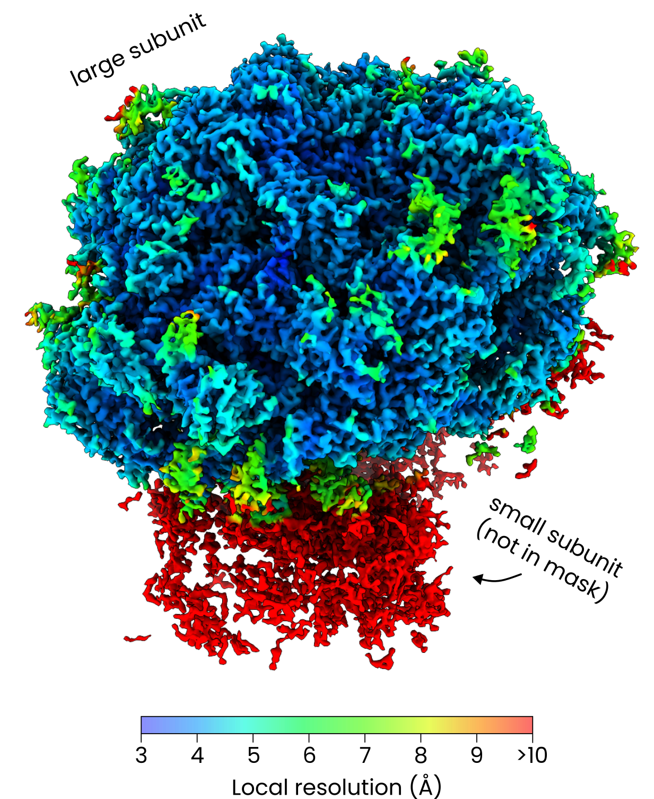

## Example 1: yeast ribosomes

In this example we used **Warp**, **AreTomo3**, **easymode**, **Relion5**, and **M** to reconstruct, denoise, segment, pick, and average the S. cerevisiae ribosome. 


??? note "Dataset and computational resources"

    For this test we used 500 tilt series of plasma-FIB milled *S. cerevisiae* cells which Sebastian Tacke and colleagues at the MPI Dortmund shared with us. They are not yet available online - but you should be able to follow along with this example using other data sources as well, since easymode networks are general.  
    We used 4 NVIDIA RTX 4090 GPUs for most processing steps.

At the onset the data in this example consisted of just tilt series and mdocs (we did not use the gain references).
```
project_root/
├── frames/        # approximately 20.000 .eer files
│   ├── 20240731_l10t01_001_6.0_20240731_170707.eer
│   ├── 20240731_l10t01_002_8.5_20240731_170731.eer
│   └── ... 
└── mdocs/         # 500 .mdoc files
    ├── 20240731_l10t01.mdoc
    ├── 20240731_l10t02.mdoc
    └── ...
```

### Step 1: tomogram reconstruction
```
easymode reconstruct --frames frames --mdocs mdocs --apix 1.56 --dose 2.05 --no_halfmaps
```
We now have 500 reconstructed tomograms at 10.00 Å/px in `warp_tiltseries/reconstruction/`.

### Step 2: tomogram denoising
```
easymode denoise --data warp_tiltseries/reconstruction --output warp_tiltseries/reconstruction/denoised --mode direct --method n2n --gpu 0,1,2,3
```
This produced 500 denoised tomograms in `warp_tiltseries/reconstruction/denoised/`.

### Step 3: ribosome segmentation
```
easymode segment ribosome --data warp_tiltseries/reconstruction/denoised --output segmented --tta 1 --gpu 0,1,2,3
```
We now have 500 ribosome segmentation volumes in `segmented/*__ribosome.mrc`.

### Step 4: ribosome picking
```
easymode pick ribosome --data segmented --output coordinates/ribosome --binning 3 --size 2000000 --spacing 250
```
This created 500 .star files in `coordinates/ribosome/`, one per tomogram, containing a total of 109081 ribosome coordinates.

### Step 5: exporting particles with WarpTools
```
conda activate warp
WarpTools ts_export_particles --input_directory coordinates/ribosome --input_pattern "*.star" --coords_angpix 10.0 --output_star relion/ribosome/particles.star --output_angpix 5.0 --box 96 --diameter 250 --2d --relative_output_paths
```

From here on, we followed the [WarpTools tutorial](https://warpem.github.io/user_guide/warptools/quick_start_warptools_tilt_series/#initial-3d-refinement-in-relion) for averaging apoferritin.

### Final result
The final average focused on the large ribosomal subunit, after multiple rounds of refinement in M, reached an overall resolution of 3.4 Å and up to 2.6 Å in the best-resolved regions. This average was weighted per tilt and per tilt series (M EstimateWeights --resolve_items --resolve_frames), but did not require any density-based 3D classification. 



