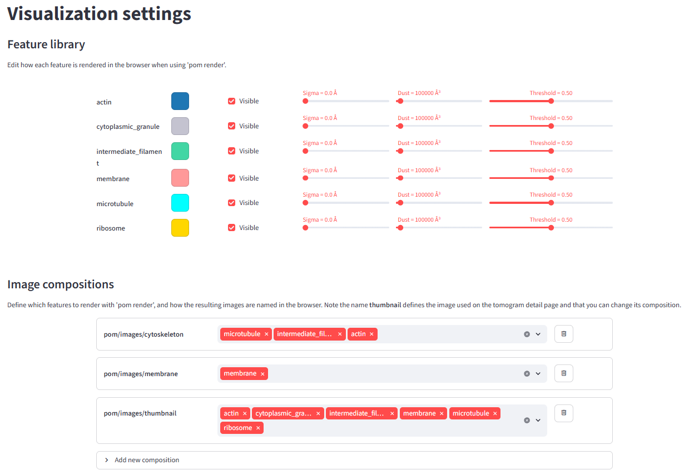

# Data browser

Pom's main feature is the **data browser**. To set it up and generate content for it, use the following commands:

- `pom initialize` — initialize a Pom project.
- `pom add_source` — tell Pom where to find tomograms and/or segmentations.
- `pom summarize` — take inventory of all tomograms and measure their composition via the segmentation volumes.
- `pom projections` — generate 2D projection images of all segmentations and a preview image for every tomogram.
- `pom render` — render segmentations in 3D, using scene compositions that can be defined in the data browser (see below).
- `pom browse` — launch the data browser.

## Sources and file name conventions

Use `pom add_source --tomograms ...` to point at directories containing tomogram `.mrc` files. Whenever you run any other command, Pom will perform the requested job for every tomogram known to it via the added sources. Even before segmenting, you can run `pom initialize; pom add_source --tomograms denoised/; pom summarize; pom projections; pom browse` to launch the app and browse your data.

Use `pom add_source --segmentations ...` to let Pom know where to find segmentation `.mrc` files. Segmentations are linked to tomograms by file name: **for any tomogram `tomogram.mrc`, segmentations must be named `tomogram__feature.mrc`**, where `feature` can be any value (e.g. `ribosome`, `nuclear_envelope`, `void`). In easymode and Ais, output filenames follow this convention automatically.

### Warp file name substitutions

In Warp, the pixel size is appended to the tomogram file name. For example, for `TS_001.mdoc`, the tomogram at 10 Å/px will be called `TS_001_10.00Apx.mrc`, while the corresponding tomogram star file is just `TS_001.tomostar`. Since `easymode segment` names its outputs based on the input `.mrc` file names, you end up with segmentations like `TS_001_10.00Apx__ribosome.mrc`.

This causes a mismatch when running `pom contextualize` on a Warp-compatible star file, where `wrpMicrographName` contains values like `TS_001.tomostar`. To bridge this, `pom contextualize` has a `--substitutions` argument. For example, to measure ribosome-to-membrane distances:

```
pom add_source --tomograms warp_tiltseries/reconstruction/
pom add_source --segmentations segmented/
pom contextualize --starfile ribosomes.star --substitutions .tomostar:_10.00Apx
```

## 3D visualization settings

With `pom render` you can define multiple scene compositions to render per tomogram. For example, you could render one scene called `cytoskeleton` featuring microtubules, intermediate filaments, and actin, and a second one called `membranes` featuring membranes only.

To configure this, run `pom browse` and go to the **Visualization settings** page. Under **Image compositions**, select *add new composition*, choose the segmented features to include, and give the composition a name. Under **Feature library** you can change the colour, threshold, postprocessing blur, and dust filter for each feature. The next time you run `pom render`, it will use these settings.



By default there is one composition called **thumbnail**, which is shown on the tomogram detail pages. The default features used in the thumbnail are `rank1`, `rank2`, `rank3`, etc. — meaning: render whichever feature is most abundant (or 2nd most, 3rd most, etc.) in each tomogram. You can exclude features from the ranking by un-checking the **Visible** box in the Feature library.
